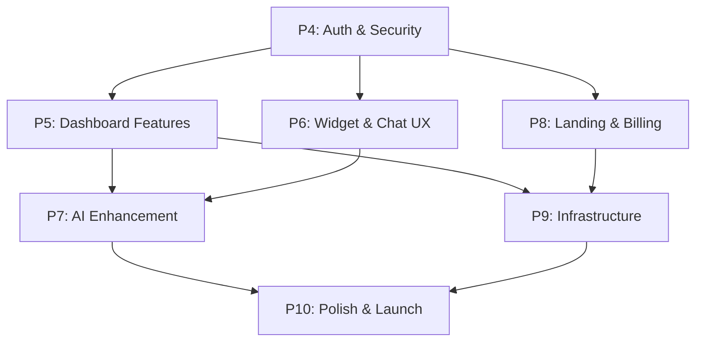

# Roadmap تولید: P4 تا P10 -- از MVP به محصول واقعی

## وضعیت فعلی (P0-P3 تکمیل شده)

پروژه یک اسکلت MVP دارد: monorepo، API بدون احراز هویت، داشبورد ساده (فقط inbox)، ویجت پایه، سرویس AI حداقلی (stub)، schema دیتابیس. **هیچ احراز هویتی پیاده نشده** -- تمام routeها باز هستند.

---

## P4 -- احراز هویت و امنیت (Authentication & Security)

> بدون این فاز هیچ‌چیز قابل عرضه نیست. اولویت مطلق.

### P4.1 -- سیستم Auth سمت API
- نصب `jose` (JWT)، `bcrypt` برای password hashing
- ایجاد جداول `sessions` و `otp_codes` در Drizzle schema ([apps/api/src/db/schema/](apps/api/src/db/schema/))
- ساخت endpointها در `routes/auth.ts`:
  - `POST /v1/auth/register` -- ثبت‌نام با email + password
  - `POST /v1/auth/login` -- ورود، برگرداندن access_token (15min) + refresh_token (7d)
  - `POST /v1/auth/refresh` -- تمدید token
  - `POST /v1/auth/logout` -- باطل‌سازی session
- ساخت auth middleware در `lib/auth.ts` -- verify JWT، extract user + workspace
- اعمال middleware روی تمام `/v1/*` routeها

### P4.2 -- RBAC و Workspace Isolation
- اصلاح `getWorkspaceId()` ([apps/api/src/lib/workspace.ts](apps/api/src/lib/workspace.ts)) -- استخراج workspace از JWT به جای header
- پیاده‌سازی role check: owner/admin/agent/viewer
- جلوگیری از دسترسی cross-workspace

### P4.3 -- Widget Visitor Token
- endpoint `POST /widget/v1/sessions` یک `visitor_token` (JWT 24h) برگرداند
- ویجت token را ذخیره و در requestهای بعدی ارسال کند
- Socket.IO اتصال با visitor_token واقعی

### P4.4 -- صفحات Login/Signup در داشبورد
- ساخت `apps/dashboard/src/app/login/page.tsx` و `signup/page.tsx`
- Auth context/provider با ذخیره token در httpOnly cookie
- Redirect به login اگر token نداشته باشد
- Guard برای تمام صفحات داشبورد

### P4.5 -- امنیت تکمیلی
- افزودن `unauthorized()` و `forbidden()` به [apps/api/src/lib/errors.ts](apps/api/src/lib/errors.ts)
- فیلتر PII از لاگ Fastify
- CSRF token برای فرم‌های داشبورد
- محدود کردن CORS origin به دامنه‌های مشخص در production

---

## P5 -- داشبورد محصول (Dashboard Features)

> هسته تجربه کاربری اپراتور. فعلاً فقط inbox خالی داریم.

### P5.1 -- UI Framework Setup
- نصب Tailwind CSS + RTL plugin + shadcn/ui در dashboard
- پیاده‌سازی layout اصلی: sidebar navigation + header + content area
- Dark mode toggle (CSS variables از [globals.css](apps/dashboard/src/app/globals.css) آماده هست)

### P5.2 -- Inbox کامل
- جستجوی مکالمات (full-text)
- فیلتر بر اساس status/channel/assigned_to
- مرتب‌سازی بر اساس زمان/اولویت
- Pagination (infinite scroll)
- Typing indicator نمایش در thread
- Read receipts

### P5.3 -- مدیریت مکالمه
- Assignment اپراتور (manual + API)
- تغییر وضعیت (open/pending/resolved/closed)
- Tags و Notes -- UI برای APIهای موجود ([apps/api/src/routes/conversations.ts](apps/api/src/routes/conversations.ts) tags/notes endpoint دارد)
- Priority levels
- Reply-to / Quote messages

### P5.4 -- پاسخ‌های آماده (Canned Responses)
- UI مدیریت canned responses (CRUD)
- جستجوی سریع با `/shortcut` در input
- متغیرها (`{{name}}`)

### P5.5 -- تنظیمات و مدیریت تیم
- صفحه Settings: پروفایل، workspace، notification preferences
- مدیریت اعضا: invite (ایمیل)، تغییر role، حذف
- صفحه workspace: نام، slug، locale، timezone

### P5.6 -- Knowledge Base UI
- آپلود اسناد (txt, pdf, md)
- لیست KBها و documentها
- وضعیت indexing (uploaded/processing/indexed/failed)
- حذف و re-index

---

## P6 -- ویجت و تجربه چت (Widget & Chat UX)

### P6.1 -- Theming و سفارشی‌سازی
- Config object: `color`, `position` (left/right), `welcomeMessage`, `avatar`, `title`
- CSS custom properties به جای hardcoded colors در [styles.ts](apps/widget/src/styles.ts)
- API endpoint برای دریافت widget config per workspace

### P6.2 -- Pre-chat Form
- فرم اطلاعات اولیه (نام، ایمیل، تلفن) قبل از شروع چت
- ذخیره در contact record
- قابل تنظیم از داشبورد (کدام فیلدها فعال باشد)

### P6.3 -- File Upload
- آپلود تصویر/فایل در چت (هم ویجت، هم داشبورد)
- ذخیره در local storage یا MinIO
- پیش‌نمایش تصویر در bubble

### P6.4 -- تجربه چت پیشرفته
- Emoji picker
- نمایش وضعیت پیام (sent/delivered/read)
- Welcome message خودکار
- Trigger-based نمایش ویجت (زمان، صفحه)
- Mobile responsive (viewport adaptation)
- Auto-detect RTL/LTR

---

## P7 -- ارتقاء سرویس AI

### P7.1 -- Intent Classifier + Router
- کلاسیفایر intent (faq/transactional/complaint/chitchat/off_topic)
- Router: مسیردهی به RAG، tool-use، یا escalation بر اساس intent + confidence
- افزودن به [apps/ai-service/app/main.py](apps/ai-service/app/main.py)

### P7.2 -- Copilot (پیشنهاد پاسخ)
- Endpoint `POST /v1/copilot` -- ۳ پیشنهاد (مختصر، دوستانه، مفصل)
- SSE streaming برای پاسخ real-time
- UI در داشبورد: دکمه "پیشنهاد AI" کنار input

### P7.3 -- Summarizer و Sentiment
- خلاصه مکالمه هنگام handoff و بازگشایی
- امتیاز sentiment هر پیام [-1..+1]
- نمایش mood indicator در inbox

### P7.4 -- بهبود RAG
- Cohere reranker (top-20 -> top-5)
- Persian normalization (half-space، اعداد فارسی، تاریخ جلالی)
- کش ۴ سطحی (embedding, retrieval, answer, intent)
- Multi-model fallback chain (OpenAI -> Claude -> local -> template)

### P7.5 -- هزینه و مانیتورینگ AI
- Per-workspace AI credits tracking
- Budget enforcement (80%/100% threshold)
- Langfuse integration برای trace و cost monitoring

---

## P8 -- لندینگ پیج و Billing واقعی

### P8.1 -- اپلیکیشن لندینگ پیج
- ساخت `apps/landing/` -- Next.js static export
- صفحات: Home (hero + features)، Pricing، About، Contact
- محتوا از [docs/marketing/](docs/marketing/) (hero.md، features.md، pricing.md)
- فرم signup -> redirect به داشبورد
- دمو زنده ویجت در صفحه

### P8.2 -- Billing واقعی (Zarinpal)
- نصب Zarinpal SDK رسمی
- جایگزینی sandbox با محیط واقعی (merchant_id از env)
- صدور فاکتور PDF
- مدیریت اشتراک در داشبورد (upgrade/downgrade/cancel)
- Trial 7 روزه خودکار
- Webhook handling: پرداخت موفق -> فعال‌سازی پلن

### P8.3 -- یکپارچه‌سازی پلن‌ها
- اعمال محدودیت‌ها بر اساس پلن (تعداد agent، مکالمه/ماه، AI credits)
- نمایش usage در داشبورد
- هشدار نزدیک شدن به سقف

---

## P9 -- زیرساخت و Deployment تولید

### P9.1 -- Dockerfiles
- Dockerfile برای هر اپ: `api`, `dashboard`, `widget`, `ai-service`, `landing`
- Multi-stage build (builder -> runner)
- `.dockerignore` بهینه

### P9.2 -- Production Docker Compose
- `docker-compose.prod.yml` شامل تمام سرویس‌ها
- Nginx reverse proxy + SSL (Let's Encrypt / certbot)
- Health checks و restart policies
- Environment-specific configs

### P9.3 -- CI/CD کامل
- GitHub Actions: build Docker images -> push به GHCR
- Job تست Python (ai-service)
- Job E2E test (Playwright)
- Dependency audit (`pnpm audit`, `pip audit`)
- Deploy trigger: SSH pull + docker compose up (ساده) یا ArgoCD (پیشرفته)

### P9.4 -- Backup و Recovery خودکار
- Cron job بکاپ Postgres (pg_dump هر ۶ ساعت)
- Rotation بکاپ‌ها (۳۰ روز)
- Script بازیابی تست‌شده
- Redis RDB snapshot

### P9.5 -- Monitoring و Alerting
- Prometheus alerting rules (API down, high latency, disk full)
- Grafana dashboards (API metrics, AI metrics, system health)
- Uptime monitoring (health endpoints)
- Log aggregation با Loki

---

## P10 -- پولیش و آمادگی لانچ

### P10.1 -- i18n (چندزبانگی)
- نصب `next-intl` در داشبورد
- فایل‌های ترجمه FA (پیش‌فرض) + EN
- تغییر زبان از settings
- ویجت: auto-detect از workspace locale

### P10.2 -- Accessibility (دسترسی‌پذیری)
- ARIA attributes روی تمام interactive elements
- Focus management و keyboard navigation
- Screen reader announcements برای پیام‌های real-time
- Color contrast WCAG 2.1 AA

### P10.3 -- Performance
- Widget bundle size audit (هدف: <30KB)
- API response time audit (هدف: P95 < 300ms)
- Database query optimization + index review
- Image/asset optimization

### P10.4 -- تست جامع
- E2E tests با Playwright (signup -> send message -> receive reply)
- Load test با k6 (target: 1000 concurrent users)
- AI eval gate در CI (regression check)
- Security penetration test

### P10.5 -- مستندات نهایی
- API documentation (Swagger/OpenAPI)
- User guide فارسی
- Developer onboarding guide
- Changelog و release notes

---

## ترتیب اجرا و وابستگی‌ها

- **P4 اول** -- بدون auth هیچ‌چیز امن نیست
- **P5 و P6 موازی** -- بعد از P4 هر دو می‌توانند همزمان پیش بروند
- **P7 بعد از P5+P6** -- AI features به UI داشبورد و ویجت وابسته‌اند
- **P8 موازی با P5** -- لندینگ و billing مستقل هستند
- **P9 بعد از P5+P8** -- وقتی اپ‌ها آماده شدند، deploy می‌کنیم
- **P10 آخر** -- پولیش نهایی قبل از لانچ عمومی

## تخمین زمانی

| فاز | مدت تقریبی | وابستگی |
|-----|-----------|---------|
| P4 | ۳-۴ روز | -- |
| P5 | ۵-۷ روز | P4 |
| P6 | ۳-۴ روز | P4 |
| P7 | ۴-۵ روز | P5, P6 |
| P8 | ۳-۴ روز | P4 |
| P9 | ۳-۴ روز | P5, P8 |
| P10 | ۴-۵ روز | P7, P9 |
| **مجموع** | **~۲۵-۳۳ روز** | |
