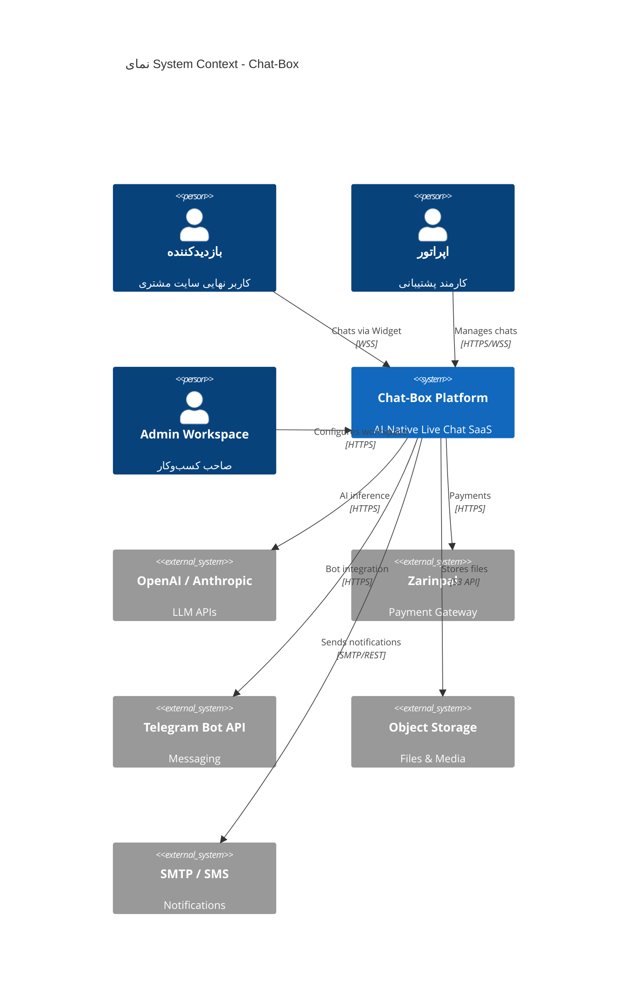
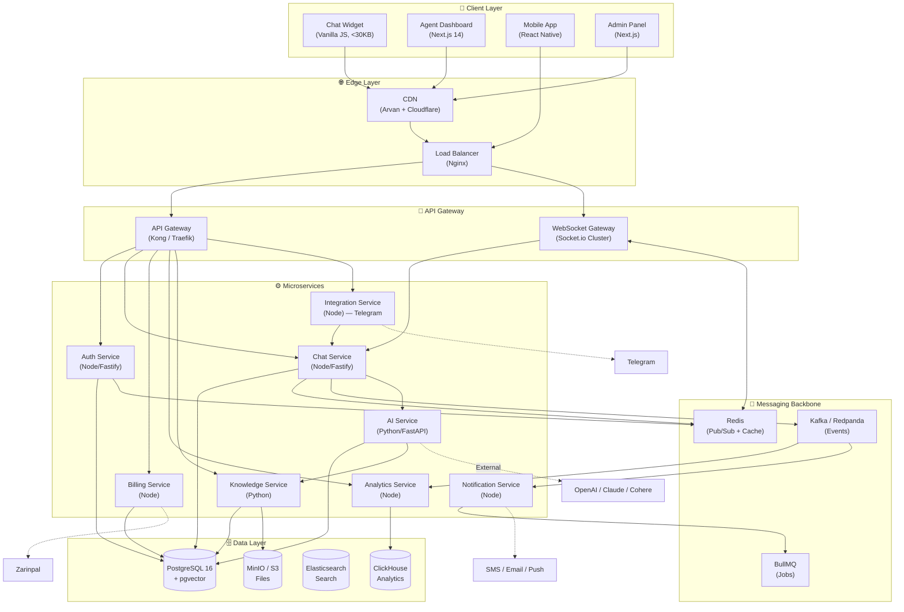
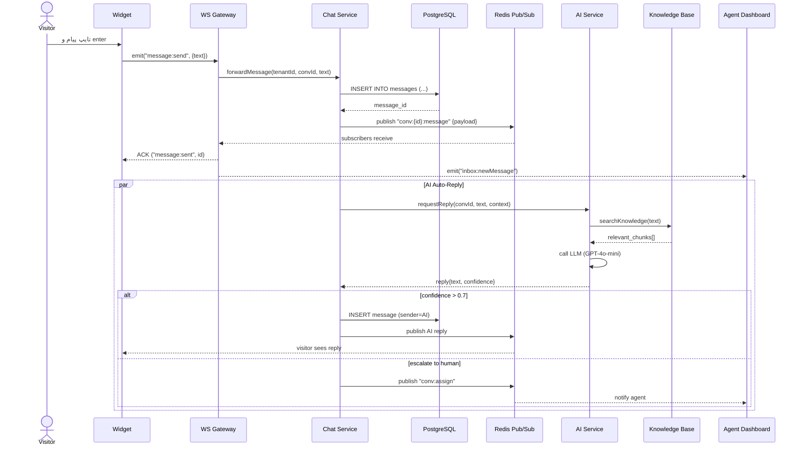
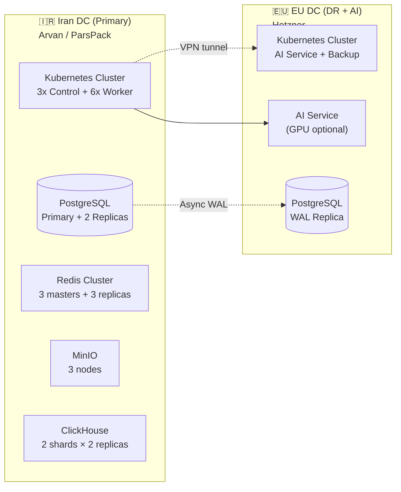

# 🏗️ سند معماری سیستم

> Chat-Box — Multi-tenant SaaS Architecture
> ورژن 1.0 · مه 2026

---

## 1. اصول معماری (Architectural Principles)

| # | اصل | پیامد عملی |
|---|---|---|
| 1 | **Event-Driven Core** | همه چیز روی Redis Pub/Sub + Kafka |
| 2 | **Stateless Services** | هر service horizontal scalable |
| 3 | **Multi-tenant by Design** | tenant_id در هر row + RLS |
| 4 | **API-First** | هر feature ابتدا API، بعد UI |
| 5 | **AI as a Service (Internal)** | لایه AI سرویس مستقل با خودش scale می‌شود |
| 6 | **Fail-Open for Reads, Fail-Closed for Writes** | خواندن همیشه، نوشتن فقط تأیید شده |
| 7 | **Iran-first Hosting** | Primary در ایران، DR در اروپا |

---

## 2. نمای کلان (C4 — Level 1: System Context)



---

## 3. نمای داخلی (C4 — Level 2: Container)



---

## 4. تشریح سرویس‌ها

### 4.1 Auth Service
- **مسئولیت:** Signup, Login (OTP/Password), JWT, 2FA, Sessions, RBAC
- **زبان/فریمورک:** Node.js + Fastify
- **DB:** PostgreSQL (users, sessions, tokens)
- **Scale:** stateless, behind LB
- **Endpoints:** `/auth/*`

### 4.2 Chat Service (هسته سیستم)
- **مسئولیت:** پیام‌رسانی، Conversation lifecycle، Assignment، typing/read receipts
- **زبان/فریمورک:** Node.js + Fastify + Socket.io
- **DB:** PostgreSQL (conversations, messages), Redis (online state)
- **Pub/Sub:** Redis (real-time fan-out), Kafka (durable event log)
- **Scale:** N replicas + Redis Adapter for Socket.io

### 4.3 AI Service ⭐ (تمایز اصلی)
- **مسئولیت:**
  - تولید پاسخ به مشتری (RAG-based)
  - پیشنهاد پاسخ به اپراتور (Copilot)
  - دسته‌بندی intent، تشخیص sentiment
  - خلاصه‌سازی مکالمه
- **زبان/فریمورک:** Python + FastAPI + LangChain
- **مدل‌ها:** GPT-4o-mini (default), GPT-4o (premium tier), Local Persian model (fallback)
- **Vector DB:** PostgreSQL + pgvector (در فاز ۱)، Qdrant (در فاز ۲)
- **Scale:** stateless, GPU-optional

### 4.4 Knowledge Service
- **مسئولیت:** Ingest URL/PDF/Docx → Chunk → Embed → ذخیره
- **زبان/فریمورک:** Python + FastAPI + Unstructured.io
- **Job Queue:** BullMQ برای crawling

### 4.5 Billing Service
- **مسئولیت:** Subscription، Invoice، درگاه پرداخت، Trial، Grace
- **زبان/فریمورک:** Node.js + Fastify
- **Webhook:** Zarinpal callbacks

### 4.6 Notification Service
- **مسئولیت:** Email (SMTP)، SMS (Kavenegar)، Push (FCM/APNs)، In-app
- **زبان/فریمورک:** Node.js + BullMQ
- **Pattern:** Worker consume از queue

### 4.7 Analytics Service
- **مسئولیت:** ETL از Kafka → ClickHouse، dashboards، export
- **DB:** ClickHouse
- **Pattern:** Streaming ingestion

### 4.8 Integration Service
- **مسئولیت:** Telegram bot lifecycle، webhook دریافت، فرمت‌سازی
- **زبان/فریمورک:** Node.js + grammy.js

---

## 5. جریان پیام ریل‌تایم (Sequence Diagram)

### سناریو: بازدیدکننده پیامی می‌فرستد و AI پاسخ می‌دهد



---

## 6. الگوهای کلیدی (Patterns)

### 6.1 Multi-Tenant Isolation
- هر row دارای `workspace_id`
- PostgreSQL Row-Level Security (RLS) فعال
- در application layer: middleware `tenantScope()` که هر query را به workspace فعلی محدود می‌کند
- در Redis: key prefix `ws:{id}:*`
- در S3: bucket per region، prefix path `workspaces/{id}/`

### 6.2 Real-time Fan-out
- Socket.io با **Redis Adapter** — همه instance ها به یک channel گوش می‌دهند
- پیام جدید → publish به `conv:{conversation_id}` → همه socket های connected دریافت می‌کنند
- برای presence (online/offline) از `set ws:{id}:online_agents` با TTL

### 6.3 Event Sourcing (سبک)
- هر اکشن مهم (پیام، assign، tag، close) به Kafka publish می‌شود
- Topic: `chatbox.events.v1`
- Consumer ها: Analytics, AI training feed, Audit log
- Format: CloudEvents 1.0 specification

### 6.4 AI Cascade (هزینه + کیفیت)
```
intent classifier (cheap, local model)
        ↓
if FAQ-like → RAG with mini model (GPT-4o-mini)
if complex → reasoning model (GPT-4o)
if confident < threshold → escalate to human
```

### 6.5 Optimistic UI
- پیام در client بلافاصله نمایش داده می‌شود (status: sending)
- بعد از ACK سرور: status: sent
- اگر error: status: failed، retry button

---

## 7. Deployment Topology



**چرا:**
- داده ایرانی روی خاک ایران (تعهد به مشتری + الزام قانونی)
- AI Service خارج چون API های OpenAI/Anthropic از داخل بسته است → proxy via EU
- Backup در EU برای disaster recovery (سیلاب، قطع برق، ...)

---

## 8. Networking & Security

| لایه | تکنولوژی | یادداشت |
|---|---|---|
| WAF | Cloudflare + Arvan | DDoS، rate limit، bot detection |
| TLS Termination | Nginx Ingress | TLS 1.3، HSTS |
| Auth | JWT (RS256) | Access 15min، Refresh 7 days با rotation |
| Service-to-Service | mTLS + JWT | داخل cluster |
| Secrets | HashiCorp Vault | rotate ماهانه |
| Encryption at rest | AES-256 (LUKS + pg_tde) | |

---

## 9. Observability Stack

| دسته | ابزار | استفاده |
|---|---|---|
| Metrics | Prometheus + Grafana | RED metrics، USE metrics |
| Logs | Loki | structured JSON، correlation_id |
| Tracing | Tempo / Jaeger | OpenTelemetry SDK |
| Error tracking | Sentry (self-hosted) | با sourcemaps |
| Uptime | Uptime Kuma | external probes |
| AI Observability | Langfuse (self-hosted) | تمام prompt/response لاگ |

---

## 10. Failure Modes & Mitigation

| سناریو | تشخیص | پاسخ |
|---|---|---|
| OpenAI API down | error rate spike | switch به Claude، بعد به مدل local |
| PostgreSQL Primary down | health check fail | promote replica (15s RTO) |
| Redis cluster down | timeout | degrade: polling mode (HTTP long-poll fallback) |
| فیلترینگ WebSocket | client reports | fallback به HTTP long-polling روی پورت ۴۴۳ |
| Zarinpal timeout | webhook delayed | grace period ۷۲h + manual reconciliation |
| Telegram API rate limit | 429 | exponential backoff + queue |

---

## 11. مرجع‌های مرتبط

- [03-TECH-STACK.md](./03-TECH-STACK.md) — انتخاب تکنولوژی‌ها
- [04-DATABASE-SCHEMA.md](./04-DATABASE-SCHEMA.md) — Schema جزئیات
- [05-API-SPEC.md](./05-API-SPEC.md) — API
- [06-AI-ARCHITECTURE.md](./06-AI-ARCHITECTURE.md) — جزئیات AI Layer
- [14-INFRASTRUCTURE.md](./14-INFRASTRUCTURE.md) — سرورها، شبکه، کانفیگ و زیرساخت عملیاتی
