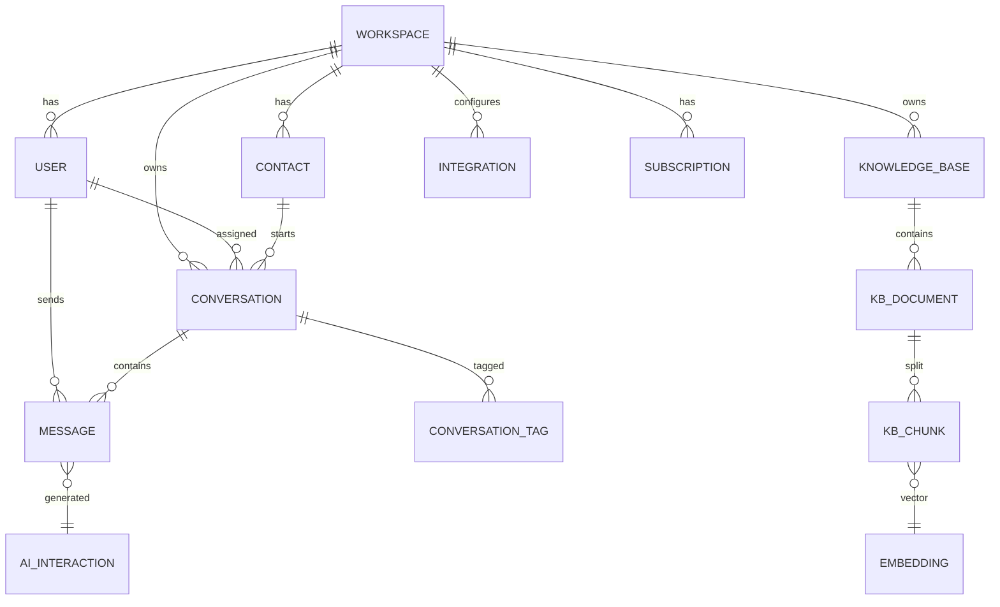

# 🗄️ سند Schema دیتابیس

> Chat-Box — Schema کامل PostgreSQL 16 با pgvector
> ورژن 1.0 · مه 2026

---

## 1. اصول طراحی Schema

| # | اصل | پیامد |
|---|---|---|
| ۱ | **هر row دارای `workspace_id`** | multi-tenant با RLS |
| ۲ | **PK ها UUIDv7** | sortable + global unique |
| ۳ | **soft-delete پیش‌فرض** | `deleted_at` column |
| ۴ | **audit columns** | `created_at`, `updated_at`, `created_by` |
| ۵ | **enums به‌جای string** | type-safety و سرعت |
| ۶ | **JSONB برای metadata غیرکوئری‌پذیر** | flexibility |
| ۷ | **FK با `ON DELETE CASCADE` فقط داخل tenant** | جلوگیری از orphan |

---

## 2. ERD (نمای کلان)



---

## 3. Schema کامل (SQL)

### 3.1 Extensions

```sql
CREATE EXTENSION IF NOT EXISTS "uuid-ossp";
CREATE EXTENSION IF NOT EXISTS "pg_trgm";        -- trigram fuzzy search
CREATE EXTENSION IF NOT EXISTS "vector";          -- pgvector
CREATE EXTENSION IF NOT EXISTS "pgcrypto";        -- gen_random_uuid
CREATE EXTENSION IF NOT EXISTS "pg_stat_statements";
```

### 3.2 Enum types

```sql
CREATE TYPE user_role AS ENUM ('owner', 'admin', 'agent', 'viewer');
CREATE TYPE user_status AS ENUM ('active', 'invited', 'suspended');
CREATE TYPE workspace_plan AS ENUM ('free', 'starter', 'pro', 'enterprise');
CREATE TYPE conversation_status AS ENUM ('open', 'pending', 'resolved', 'closed', 'spam');
CREATE TYPE conversation_channel AS ENUM ('widget', 'telegram', 'email', 'api');
CREATE TYPE message_type AS ENUM ('text', 'image', 'file', 'audio', 'system', 'ai_reply');
CREATE TYPE message_sender_type AS ENUM ('contact', 'agent', 'ai', 'system');
CREATE TYPE message_status AS ENUM ('queued', 'sent', 'delivered', 'read', 'failed');
CREATE TYPE invoice_status AS ENUM ('draft', 'pending', 'paid', 'failed', 'refunded');
CREATE TYPE kb_doc_status AS ENUM ('uploaded', 'processing', 'indexed', 'failed');
```

### 3.3 جدول `workspaces`

```sql
CREATE TABLE workspaces (
  id              UUID        PRIMARY KEY DEFAULT gen_random_uuid(),
  slug            TEXT        NOT NULL UNIQUE,
  name            TEXT        NOT NULL,
  owner_user_id   UUID        NOT NULL,
  plan            workspace_plan NOT NULL DEFAULT 'free',
  locale          TEXT        NOT NULL DEFAULT 'fa-IR',
  timezone        TEXT        NOT NULL DEFAULT 'Asia/Tehran',
  settings        JSONB       NOT NULL DEFAULT '{}'::jsonb,
  ai_credits      INTEGER     NOT NULL DEFAULT 0,
  trial_ends_at   TIMESTAMPTZ,
  created_at      TIMESTAMPTZ NOT NULL DEFAULT now(),
  updated_at      TIMESTAMPTZ NOT NULL DEFAULT now(),
  deleted_at      TIMESTAMPTZ
);

CREATE INDEX idx_workspaces_owner ON workspaces(owner_user_id) WHERE deleted_at IS NULL;
CREATE INDEX idx_workspaces_plan ON workspaces(plan) WHERE deleted_at IS NULL;
```

### 3.4 جدول `users`

```sql
CREATE TABLE users (
  id              UUID        PRIMARY KEY DEFAULT gen_random_uuid(),
  email           TEXT        UNIQUE,
  phone           TEXT        UNIQUE,
  password_hash   TEXT,
  full_name       TEXT,
  avatar_url      TEXT,
  locale          TEXT        NOT NULL DEFAULT 'fa-IR',
  totp_secret     TEXT,
  email_verified  BOOLEAN     NOT NULL DEFAULT false,
  phone_verified  BOOLEAN     NOT NULL DEFAULT false,
  last_login_at   TIMESTAMPTZ,
  created_at      TIMESTAMPTZ NOT NULL DEFAULT now(),
  updated_at      TIMESTAMPTZ NOT NULL DEFAULT now(),
  deleted_at      TIMESTAMPTZ,

  CONSTRAINT chk_user_identity CHECK (email IS NOT NULL OR phone IS NOT NULL)
);

CREATE INDEX idx_users_email_active ON users(email) WHERE deleted_at IS NULL;
CREATE INDEX idx_users_phone_active ON users(phone) WHERE deleted_at IS NULL;
```

### 3.5 جدول `workspace_members` (join)

```sql
CREATE TABLE workspace_members (
  workspace_id    UUID        NOT NULL REFERENCES workspaces(id) ON DELETE CASCADE,
  user_id         UUID        NOT NULL REFERENCES users(id) ON DELETE CASCADE,
  role            user_role   NOT NULL DEFAULT 'agent',
  status          user_status NOT NULL DEFAULT 'invited',
  invited_by      UUID        REFERENCES users(id),
  joined_at       TIMESTAMPTZ,
  created_at      TIMESTAMPTZ NOT NULL DEFAULT now(),

  PRIMARY KEY (workspace_id, user_id)
);

CREATE INDEX idx_members_user ON workspace_members(user_id);
```

### 3.6 جدول `contacts` (مشتری نهایی)

```sql
CREATE TABLE contacts (
  id              UUID        PRIMARY KEY DEFAULT gen_random_uuid(),
  workspace_id    UUID        NOT NULL REFERENCES workspaces(id) ON DELETE CASCADE,
  external_id     TEXT,                 -- شناسه از سیستم مشتری
  full_name       TEXT,
  email           TEXT,
  phone           TEXT,
  telegram_id     BIGINT,
  avatar_url      TEXT,
  metadata        JSONB       NOT NULL DEFAULT '{}'::jsonb,
  tags            TEXT[]      NOT NULL DEFAULT '{}',
  first_seen_at   TIMESTAMPTZ NOT NULL DEFAULT now(),
  last_seen_at    TIMESTAMPTZ NOT NULL DEFAULT now(),
  created_at      TIMESTAMPTZ NOT NULL DEFAULT now(),
  updated_at      TIMESTAMPTZ NOT NULL DEFAULT now()
);

CREATE UNIQUE INDEX idx_contacts_ws_email ON contacts(workspace_id, email) WHERE email IS NOT NULL;
CREATE UNIQUE INDEX idx_contacts_ws_phone ON contacts(workspace_id, phone) WHERE phone IS NOT NULL;
CREATE UNIQUE INDEX idx_contacts_ws_tg ON contacts(workspace_id, telegram_id) WHERE telegram_id IS NOT NULL;
CREATE INDEX idx_contacts_tags ON contacts USING GIN(tags);
CREATE INDEX idx_contacts_metadata ON contacts USING GIN(metadata);
```

### 3.7 جدول `conversations`

```sql
CREATE TABLE conversations (
  id                  UUID        PRIMARY KEY DEFAULT gen_random_uuid(),
  workspace_id        UUID        NOT NULL REFERENCES workspaces(id) ON DELETE CASCADE,
  contact_id          UUID        NOT NULL REFERENCES contacts(id) ON DELETE CASCADE,
  channel             conversation_channel NOT NULL,
  status              conversation_status  NOT NULL DEFAULT 'open',
  assigned_agent_id   UUID        REFERENCES users(id),
  ai_handled          BOOLEAN     NOT NULL DEFAULT false,
  priority            SMALLINT    NOT NULL DEFAULT 0,  -- 0..3
  sentiment_score     NUMERIC(3,2),                     -- -1.00..1.00
  csat_score          SMALLINT,                         -- 1..5
  subject             TEXT,
  last_message_at     TIMESTAMPTZ,
  last_agent_reply_at TIMESTAMPTZ,
  first_response_sec  INTEGER,
  closed_at           TIMESTAMPTZ,
  metadata            JSONB       NOT NULL DEFAULT '{}'::jsonb,
  created_at          TIMESTAMPTZ NOT NULL DEFAULT now(),
  updated_at          TIMESTAMPTZ NOT NULL DEFAULT now()
);

CREATE INDEX idx_conv_ws_status ON conversations(workspace_id, status, last_message_at DESC);
CREATE INDEX idx_conv_assigned ON conversations(assigned_agent_id, status) WHERE assigned_agent_id IS NOT NULL;
CREATE INDEX idx_conv_contact ON conversations(contact_id, created_at DESC);
CREATE INDEX idx_conv_ws_channel ON conversations(workspace_id, channel);
```

### 3.8 جدول `messages`

```sql
CREATE TABLE messages (
  id                  UUID        PRIMARY KEY DEFAULT gen_random_uuid(),
  workspace_id        UUID        NOT NULL REFERENCES workspaces(id) ON DELETE CASCADE,
  conversation_id     UUID        NOT NULL REFERENCES conversations(id) ON DELETE CASCADE,
  sender_type         message_sender_type NOT NULL,
  sender_user_id      UUID        REFERENCES users(id),    -- اگر agent باشد
  sender_contact_id   UUID        REFERENCES contacts(id), -- اگر contact باشد
  type                message_type NOT NULL DEFAULT 'text',
  body                TEXT,                                -- متن، یا alt برای media
  attachments         JSONB,                               -- [{url, type, name, size}]
  reply_to_id         UUID        REFERENCES messages(id),
  reactions           JSONB,                               -- {emoji: [user_ids]}
  status              message_status NOT NULL DEFAULT 'sent',
  ai_confidence       NUMERIC(3,2),                        -- 0..1 برای ai_reply
  ai_model            TEXT,                                -- gpt-4o-mini, claude, ...
  ai_cost_usd         NUMERIC(10,6),
  edited_at           TIMESTAMPTZ,
  delivered_at        TIMESTAMPTZ,
  read_at             TIMESTAMPTZ,
  created_at          TIMESTAMPTZ NOT NULL DEFAULT now()
);

CREATE INDEX idx_msg_conv ON messages(conversation_id, created_at);
CREATE INDEX idx_msg_ws_created ON messages(workspace_id, created_at DESC);
CREATE INDEX idx_msg_fts ON messages USING GIN(to_tsvector('simple', body));
```

> **توجه:** برای فاز ۲ این جدول `partition by RANGE(created_at)` می‌شود (ماهانه).

### 3.9 جدول `conversation_tags`

```sql
CREATE TABLE conversation_tags (
  conversation_id UUID NOT NULL REFERENCES conversations(id) ON DELETE CASCADE,
  tag             TEXT NOT NULL,
  created_at      TIMESTAMPTZ NOT NULL DEFAULT now(),
  PRIMARY KEY (conversation_id, tag)
);
CREATE INDEX idx_conv_tags_tag ON conversation_tags(tag);
```

### 3.10 جدول `conversation_notes` (یادداشت داخلی)

```sql
CREATE TABLE conversation_notes (
  id              UUID        PRIMARY KEY DEFAULT gen_random_uuid(),
  conversation_id UUID        NOT NULL REFERENCES conversations(id) ON DELETE CASCADE,
  author_id       UUID        NOT NULL REFERENCES users(id),
  body            TEXT        NOT NULL,
  created_at      TIMESTAMPTZ NOT NULL DEFAULT now()
);
```

### 3.11 جدول `canned_responses`

```sql
CREATE TABLE canned_responses (
  id              UUID        PRIMARY KEY DEFAULT gen_random_uuid(),
  workspace_id    UUID        NOT NULL REFERENCES workspaces(id) ON DELETE CASCADE,
  shortcut        TEXT        NOT NULL,        -- /greet
  title           TEXT        NOT NULL,
  body            TEXT        NOT NULL,
  variables       JSONB,                       -- ["name", "order_id"]
  created_by      UUID        REFERENCES users(id),
  usage_count     INTEGER     NOT NULL DEFAULT 0,
  created_at      TIMESTAMPTZ NOT NULL DEFAULT now(),

  UNIQUE (workspace_id, shortcut)
);
```

---

## 4. لایه AI (Knowledge Base)

### 4.1 `knowledge_bases`

```sql
CREATE TABLE knowledge_bases (
  id              UUID        PRIMARY KEY DEFAULT gen_random_uuid(),
  workspace_id    UUID        NOT NULL REFERENCES workspaces(id) ON DELETE CASCADE,
  name            TEXT        NOT NULL,
  description     TEXT,
  embedding_model TEXT        NOT NULL DEFAULT 'text-embedding-3-small',
  settings        JSONB       NOT NULL DEFAULT '{}'::jsonb,
  created_at      TIMESTAMPTZ NOT NULL DEFAULT now()
);
```

### 4.2 `kb_documents`

```sql
CREATE TABLE kb_documents (
  id              UUID        PRIMARY KEY DEFAULT gen_random_uuid(),
  workspace_id    UUID        NOT NULL REFERENCES workspaces(id) ON DELETE CASCADE,
  kb_id           UUID        NOT NULL REFERENCES knowledge_bases(id) ON DELETE CASCADE,
  source_type     TEXT        NOT NULL,     -- url | pdf | docx | manual
  source_url      TEXT,
  file_path       TEXT,
  title           TEXT,
  status          kb_doc_status NOT NULL DEFAULT 'uploaded',
  size_bytes      BIGINT,
  page_count      INTEGER,
  chunk_count     INTEGER     NOT NULL DEFAULT 0,
  last_indexed_at TIMESTAMPTZ,
  error_message   TEXT,
  metadata        JSONB,
  created_at      TIMESTAMPTZ NOT NULL DEFAULT now()
);
CREATE INDEX idx_kbdoc_kb ON kb_documents(kb_id, status);
```

### 4.3 `kb_chunks` (vector store)

```sql
CREATE TABLE kb_chunks (
  id              UUID        PRIMARY KEY DEFAULT gen_random_uuid(),
  workspace_id    UUID        NOT NULL REFERENCES workspaces(id) ON DELETE CASCADE,
  document_id     UUID        NOT NULL REFERENCES kb_documents(id) ON DELETE CASCADE,
  chunk_index     INTEGER     NOT NULL,
  content         TEXT        NOT NULL,
  content_tokens  INTEGER,
  embedding       VECTOR(1536),                -- text-embedding-3-small dim
  metadata        JSONB,
  created_at      TIMESTAMPTZ NOT NULL DEFAULT now()
);

-- HNSW index برای ANN search
CREATE INDEX idx_chunks_embedding_hnsw
  ON kb_chunks USING hnsw (embedding vector_cosine_ops)
  WITH (m = 16, ef_construction = 64);

CREATE INDEX idx_chunks_doc ON kb_chunks(document_id, chunk_index);
CREATE INDEX idx_chunks_ws ON kb_chunks(workspace_id);
```

### 4.4 `ai_interactions` (log کامل)

```sql
CREATE TABLE ai_interactions (
  id              UUID        PRIMARY KEY DEFAULT gen_random_uuid(),
  workspace_id    UUID        NOT NULL REFERENCES workspaces(id) ON DELETE CASCADE,
  conversation_id UUID        REFERENCES conversations(id) ON DELETE CASCADE,
  message_id      UUID        REFERENCES messages(id) ON DELETE SET NULL,
  purpose         TEXT        NOT NULL,        -- auto_reply | copilot | summary | classify
  model           TEXT        NOT NULL,
  prompt          TEXT,
  response        TEXT,
  retrieved_chunks JSONB,                       -- [{chunk_id, score}]
  input_tokens    INTEGER,
  output_tokens   INTEGER,
  cost_usd        NUMERIC(10,6),
  latency_ms      INTEGER,
  confidence      NUMERIC(3,2),
  escalated       BOOLEAN     NOT NULL DEFAULT false,
  feedback        SMALLINT,                    -- -1 / 0 / +1 از اپراتور
  created_at      TIMESTAMPTZ NOT NULL DEFAULT now()
);
CREATE INDEX idx_ai_ws_created ON ai_interactions(workspace_id, created_at DESC);
CREATE INDEX idx_ai_purpose ON ai_interactions(purpose, created_at DESC);
```

---

## 5. Auth & Sessions

### 5.1 `sessions`

```sql
CREATE TABLE sessions (
  id              TEXT        PRIMARY KEY,     -- Lucia generates
  user_id         UUID        NOT NULL REFERENCES users(id) ON DELETE CASCADE,
  expires_at      TIMESTAMPTZ NOT NULL,
  user_agent      TEXT,
  ip_address      INET,
  created_at      TIMESTAMPTZ NOT NULL DEFAULT now()
);
CREATE INDEX idx_sessions_user ON sessions(user_id);
CREATE INDEX idx_sessions_expires ON sessions(expires_at);
```

### 5.2 `otp_codes`

```sql
CREATE TABLE otp_codes (
  id              UUID        PRIMARY KEY DEFAULT gen_random_uuid(),
  identifier      TEXT        NOT NULL,        -- email or phone
  code_hash       TEXT        NOT NULL,
  purpose         TEXT        NOT NULL,        -- login | reset | verify
  attempts        SMALLINT    NOT NULL DEFAULT 0,
  expires_at      TIMESTAMPTZ NOT NULL,
  consumed_at     TIMESTAMPTZ,
  created_at      TIMESTAMPTZ NOT NULL DEFAULT now()
);
CREATE INDEX idx_otp_identifier ON otp_codes(identifier, purpose) WHERE consumed_at IS NULL;
```

---

## 6. Billing

### 6.1 `subscriptions`

```sql
CREATE TABLE subscriptions (
  id              UUID        PRIMARY KEY DEFAULT gen_random_uuid(),
  workspace_id    UUID        NOT NULL UNIQUE REFERENCES workspaces(id) ON DELETE CASCADE,
  plan            workspace_plan NOT NULL,
  status          TEXT        NOT NULL,        -- trialing | active | past_due | canceled
  period_start    DATE        NOT NULL,
  period_end      DATE        NOT NULL,
  seats           INTEGER     NOT NULL DEFAULT 1,
  amount_irr      BIGINT,
  auto_renew      BOOLEAN     NOT NULL DEFAULT true,
  canceled_at     TIMESTAMPTZ,
  created_at      TIMESTAMPTZ NOT NULL DEFAULT now(),
  updated_at      TIMESTAMPTZ NOT NULL DEFAULT now()
);
```

### 6.2 `invoices`

```sql
CREATE TABLE invoices (
  id              UUID        PRIMARY KEY DEFAULT gen_random_uuid(),
  workspace_id    UUID        NOT NULL REFERENCES workspaces(id) ON DELETE CASCADE,
  subscription_id UUID        REFERENCES subscriptions(id),
  number          TEXT        NOT NULL UNIQUE,    -- INV-1405-000001
  status          invoice_status NOT NULL DEFAULT 'draft',
  amount_irr      BIGINT      NOT NULL,
  tax_irr         BIGINT      NOT NULL DEFAULT 0,
  total_irr       BIGINT      NOT NULL,
  gateway         TEXT,                            -- zarinpal | nextpay
  gateway_ref     TEXT,
  paid_at         TIMESTAMPTZ,
  pdf_url         TEXT,
  metadata        JSONB,
  created_at      TIMESTAMPTZ NOT NULL DEFAULT now()
);
CREATE INDEX idx_invoices_ws ON invoices(workspace_id, created_at DESC);
```

### 6.3 `usage_records` (متر زدن AI)

```sql
CREATE TABLE usage_records (
  id              UUID        PRIMARY KEY DEFAULT gen_random_uuid(),
  workspace_id    UUID        NOT NULL REFERENCES workspaces(id) ON DELETE CASCADE,
  metric          TEXT        NOT NULL,        -- ai_messages | kb_storage_mb | seats
  quantity        BIGINT      NOT NULL,
  period          DATE        NOT NULL,
  cost_irr        BIGINT,
  metadata        JSONB,
  created_at      TIMESTAMPTZ NOT NULL DEFAULT now()
);
CREATE INDEX idx_usage_ws_period ON usage_records(workspace_id, period);
```

---

## 7. Integrations

### 7.1 `integrations`

```sql
CREATE TABLE integrations (
  id              UUID        PRIMARY KEY DEFAULT gen_random_uuid(),
  workspace_id    UUID        NOT NULL REFERENCES workspaces(id) ON DELETE CASCADE,
  type            TEXT        NOT NULL,        -- telegram | webhook | api
  name            TEXT        NOT NULL,
  config          JSONB       NOT NULL,        -- {bot_token: ...} (رمزنگاری شده)
  active          BOOLEAN     NOT NULL DEFAULT true,
  last_used_at    TIMESTAMPTZ,
  created_at      TIMESTAMPTZ NOT NULL DEFAULT now(),

  UNIQUE (workspace_id, type, name)
);
```

### 7.2 `webhooks` (outbound)

```sql
CREATE TABLE webhooks (
  id              UUID        PRIMARY KEY DEFAULT gen_random_uuid(),
  workspace_id    UUID        NOT NULL REFERENCES workspaces(id) ON DELETE CASCADE,
  url             TEXT        NOT NULL,
  secret          TEXT        NOT NULL,
  events          TEXT[]      NOT NULL,         -- ['conversation.created', 'message.sent']
  active          BOOLEAN     NOT NULL DEFAULT true,
  failure_count   INTEGER     NOT NULL DEFAULT 0,
  created_at      TIMESTAMPTZ NOT NULL DEFAULT now()
);
```

---

## 8. Audit & Events

### 8.1 `audit_logs`

```sql
CREATE TABLE audit_logs (
  id              UUID        PRIMARY KEY DEFAULT gen_random_uuid(),
  workspace_id    UUID        REFERENCES workspaces(id) ON DELETE SET NULL,
  actor_user_id   UUID        REFERENCES users(id),
  action          TEXT        NOT NULL,         -- user.invite | workspace.update
  target_type     TEXT,
  target_id       UUID,
  diff            JSONB,
  ip_address      INET,
  user_agent      TEXT,
  created_at      TIMESTAMPTZ NOT NULL DEFAULT now()
);
CREATE INDEX idx_audit_ws_created ON audit_logs(workspace_id, created_at DESC);
```

---

## 9. Row-Level Security (RLS)

### 9.1 فعال‌سازی RLS

```sql
-- برای هر جدول tenant-scoped:
ALTER TABLE conversations ENABLE ROW LEVEL SECURITY;
ALTER TABLE messages      ENABLE ROW LEVEL SECURITY;
ALTER TABLE contacts      ENABLE ROW LEVEL SECURITY;
ALTER TABLE kb_chunks     ENABLE ROW LEVEL SECURITY;
-- ... و بقیه‌ی جداول workspace-scoped
```

### 9.2 Policy نمونه

```sql
-- application هر کانکشن را با SET می‌کند:
-- SET app.current_workspace = '<workspace_id>';

CREATE POLICY tenant_isolation ON conversations
  USING (workspace_id = current_setting('app.current_workspace')::uuid);

CREATE POLICY tenant_isolation ON messages
  USING (workspace_id = current_setting('app.current_workspace')::uuid);
```

### 9.3 Bypass برای admin

```sql
-- یک role جدا برای internal admin/migrations:
CREATE ROLE chatbox_admin;
ALTER ROLE chatbox_admin BYPASSRLS;
```

---

## 10. Triggers مهم

### 10.1 updated_at خودکار

```sql
CREATE OR REPLACE FUNCTION set_updated_at()
RETURNS TRIGGER AS $$
BEGIN
  NEW.updated_at = now();
  RETURN NEW;
END;
$$ LANGUAGE plpgsql;

CREATE TRIGGER trg_workspaces_updated BEFORE UPDATE ON workspaces
  FOR EACH ROW EXECUTE FUNCTION set_updated_at();
-- ... برای هر جدول
```

### 10.2 conversation.last_message_at از message

```sql
CREATE OR REPLACE FUNCTION update_conversation_last_message()
RETURNS TRIGGER AS $$
BEGIN
  UPDATE conversations
     SET last_message_at = NEW.created_at,
         last_agent_reply_at = CASE WHEN NEW.sender_type = 'agent' THEN NEW.created_at ELSE last_agent_reply_at END,
         updated_at = now()
   WHERE id = NEW.conversation_id;
  RETURN NEW;
END;
$$ LANGUAGE plpgsql;

CREATE TRIGGER trg_msg_update_conv AFTER INSERT ON messages
  FOR EACH ROW EXECUTE FUNCTION update_conversation_last_message();
```

---

## 11. استراتژی Index و Performance

| سناریو | Index | یادداشت |
|---|---|---|
| Inbox اپراتور | `idx_conv_ws_status` | DESC روی last_message_at |
| سرچ پیام | `idx_msg_fts` (GIN tsvector) | برای فارسی: configuration `simple` بهتر است |
| Vector RAG | `idx_chunks_embedding_hnsw` | HNSW با m=16، ef=64 |
| Lookup مخاطب | `idx_contacts_ws_email` | unique partial |
| Recent AI usage | `idx_ai_ws_created` | برای billing |

### نکات
- `pg_stat_statements` فعال باشد، slow queries (> 100ms) ماهانه review
- `EXPLAIN ANALYZE` بخشی از CI برای migrations
- جدول `messages` بعد از ۵۰M row → partitioning ماهانه

---

## 12. Migration و Seeding

### Migration framework
**Drizzle Kit** برای schema diff و migration:

```bash
pnpm drizzle-kit generate:pg     # تولید SQL
pnpm drizzle-kit push            # اجرا
```

### Seed data
- یک `super_admin` user
- یک `demo_workspace` با ۵ conversation نمونه
- ۳ canned response پیش‌فرض
- پلن‌های billing با قیمت

### Naming convention
- جداول snake_case، PK = `id`
- جدول‌های join: `singular1_singular2s` (مثلاً `workspace_members`)
- timestamps همیشه `TIMESTAMPTZ`، نام `_at` در آخر

---

## 13. Data Retention

| داده | TTL | روش |
|---|---|---|
| Sessions منقضی | ۳۰ روز | cron daily DELETE |
| OTP consumed | ۷ روز | cron |
| Audit logs | ۳۶۵ روز | archive به ClickHouse |
| Soft-deleted rows | ۹۰ روز | hard delete با cron |
| AI interactions | ۳۶۵ روز | archive به ClickHouse |
| Messages (پلن free) | ۹۰ روز | archive |
| Messages (پلن paid) | نامحدود | — |

---

## 14. Backup & DR

- **Continuous WAL archiving** به Object Storage (MinIO + S3 خارجی)
- **Snapshot روزانه** کامل: ۳۰ روز نگه‌داری
- **Snapshot هفتگی:** ۹۰ روز
- **Cross-region replica** (EU) async
- **RTO:** ۱۵ دقیقه — **RPO:** ۵ دقیقه

---

## 15. مرجع‌های مرتبط

- [`02-ARCHITECTURE.md`](./02-ARCHITECTURE.md) — کجای معماری از این schema استفاده می‌شود
- [`03-TECH-STACK.md`](./03-TECH-STACK.md) — چرا Postgres
- [`06-AI-ARCHITECTURE.md`](./06-AI-ARCHITECTURE.md) — جزئیات استفاده pgvector
