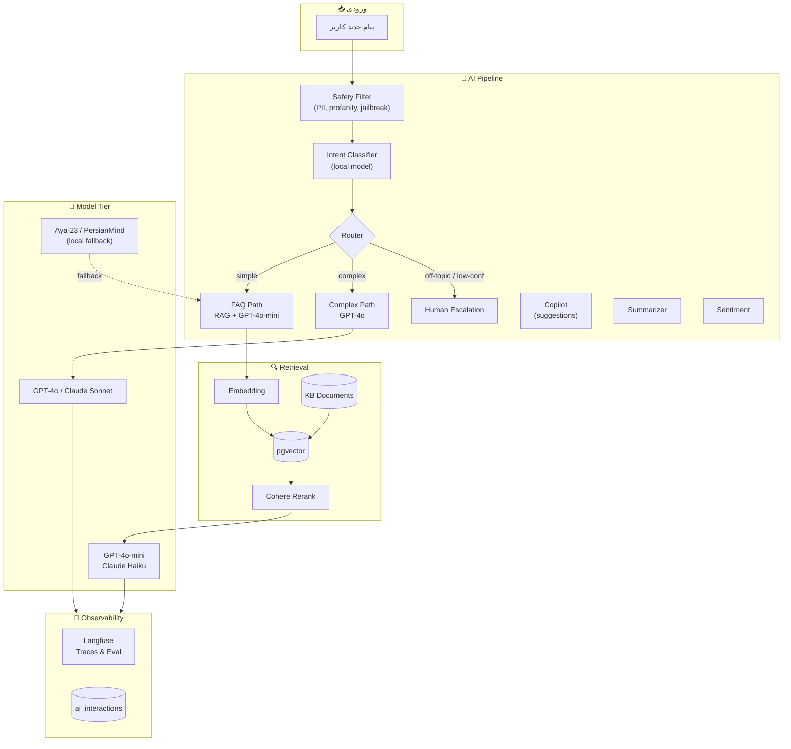
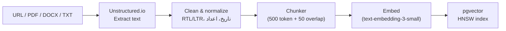

# 🤖 سند معماری AI

> Chat-Box — لایه AI: Auto-Reply، Copilot، RAG، Routing، Eval
> ورژن 1.0 · مه 2026

---

## 1. اصول معماری AI

| اصل | پیامد عملی |
|---|---|
| **AI-First از روز اول** | هر مکالمه ابتدا از کانال AI رد می‌شود |
| **Cascading model strategy** | سبک → سنگین، فقط در صورت نیاز |
| **Persian-native** | همه prompt ها به فارسی، embedding چندزبانه |
| **Eval قبل از Deploy** | هر تغییر prompt یا مدل از gates عبور کند |
| **Cost-aware** | budget per workspace، fallback اتوماتیک |
| **Human escalation graceful** | confidence پایین = handoff شفاف |
| **Observable** | Langfuse برای trace هر prompt/response |

---

## 2. نمای کلی لایه AI



---

## 3. مدل‌های مورد استفاده

### 3.1 جدول مدل‌ها

| Tier | مدل | استفاده | هزینه (per 1M tokens) | latency P95 |
|---|---|---|---|---|
| Mini | **GPT-4o-mini** | RAG-based auto-reply، classify | $0.15 / $0.60 | ~800ms |
| Mini Fallback | **Claude 3.5 Haiku** | همان، fallback | $0.80 / $4.00 | ~700ms |
| Reasoning | **GPT-4o** | پاسخ پیچیده، summarize طولانی | $2.50 / $10 | ~2.5s |
| Reasoning Fallback | **Claude 3.5 Sonnet** | همان | $3.00 / $15 | ~2s |
| Local | **Aya-23 (8B)** | fallback مطلق، privacy-strict tenants | self-host (GPU) | ~1.5s |
| Embedding | **text-embedding-3-small** (1536d) | RAG vectors | $0.02 / 1M | ~150ms |
| Embedding fallback | **BGE-M3** (1024d) | local | self-host | ~300ms |
| Rerank | **Cohere rerank-multilingual-v3** | reorder top-k | $1 / 1k searches | ~200ms |

### 3.2 انتخاب مدل بر اساس tenant tier

| Plan | Default model | Reasoning model | Embedding | Notes |
|---|---|---|---|---|
| Free | gpt-4o-mini | — (escalate) | text-embedding-3-small | 100 AI msg/month |
| Starter | gpt-4o-mini | gpt-4o (limit) | text-embedding-3-small | 1k AI msg/month |
| Pro | gpt-4o-mini | gpt-4o | text-embedding-3-small | 10k AI msg/month |
| Enterprise | configurable | configurable | configurable | unlimited + local option |

---

## 4. Pipeline تفصیلی

### 4.1 Safety Filter

پیش از هر LLM call:

- **PII detection:** کارت ملی، شماره کارت بانکی، آدرس → mask
- **Profanity:** لیست واژگان فارسی + classifier سبک
- **Jailbreak/prompt injection:** الگوهای رایج (`ignore previous instructions`، ...)
- **Length limit:** max 4000 char per message; truncate با warning

اگر فیلتر آلارم دهد → log + در صورت high-risk، escalate به انسان.

### 4.2 Intent Classifier

یک مدل سبک محلی (یا fine-tuned با fast call):

**کلاس‌ها:**
- `faq` — سؤال FAQ-like (پشتیبانی، محصول، قیمت)
- `transactional` — نیاز به action (لغو سفارش، تغییر آدرس)
- `complaint` — شکایت/منفی
- `chitchat` — گفت‌وگوی غیرمرتبط
- `off_topic` — خارج از حوزه

**اجرا:**
- مرحله ۱: keyword + regex سریع
- مرحله ۲: GPT-4o-mini با classification prompt (در صورت ابهام)
- caching: hash پیام → result (TTL ۲۴ ساعت)

### 4.3 Router

```
intent = "faq"           → RAG path (mini model)
intent = "transactional" → tool-use path (mini model with function-calling)
intent = "complaint"     → escalate immediately + sentiment tag
intent = "chitchat"      → mini model with persona prompt
intent = "off_topic"     → escalate
```

اگر **confidence < 0.5** در هر مرحله → escalate.

### 4.4 RAG Pipeline (Auto-Reply)

```
1. Embed query (text-embedding-3-small)
2. Vector search در pgvector (top 20 candidates)
3. Cohere rerank → top 5
4. Build context window:
   - system prompt (persona تنظیم workspace)
   - retrieved chunks (با source citation)
   - conversation history (last 10 messages)
   - current message
5. Call GPT-4o-mini با max_tokens=400
6. Output:
   - text (پاسخ نهایی)
   - confidence (از self-evaluation prompt)
   - cited_chunks (برای dashboard show)
7. اگر confidence > threshold (default 0.7):
   - publish به user
   - log به ai_interactions
8. اگر < threshold:
   - escalate به human، attach suggestion
```

### 4.5 Tool-Use (Transactional)

برای intent های action-base، **function calling** فعال است:

**Tools موجود (per workspace قابل تنظیم):**

```jsonc
[
  {
    "name": "search_order",
    "description": "جستجوی سفارش بر اساس شماره",
    "parameters": { "order_id": "string" }
  },
  {
    "name": "cancel_order",
    "description": "لغو سفارش",
    "parameters": { "order_id": "string", "reason": "string" },
    "requires_confirmation": true
  },
  {
    "name": "create_ticket",
    "description": "ساخت تیکت پشتیبانی برای موارد سخت",
    "parameters": { "subject": "string", "priority": "low|normal|high" }
  }
]
```

Workspace می‌تواند tool هایش را با Webhook به سیستم خودش (مثلاً WooCommerce) متصل کند.

### 4.6 Copilot (پیشنهاد به اپراتور)

- Trigger: هر بار اپراتور وارد یک conversation می‌شود، یا دکمه “پیشنهاد بده” می‌زند
- Context: کل تاریخچه + KB + persona
- Output: ۳ پیشنهاد (Brief, Friendly, Detailed)
- Latency target: **< 800ms**
- Streaming: SSE برای نمایش تدریجی

### 4.7 Summarizer

- در ۳ سناریو فعال:
  - **Handoff** — وقتی conv به اپراتور escalate می‌شود
  - **Reopen** — وقتی مکالمه بعد از ۲۴ ساعت ادامه پیدا می‌کند
  - **Manual** — اپراتور دکمه می‌زند
- Output: ۳–۵ خط: مشتری کیست، چه می‌خواست، چه گفته شده، action لازم

### 4.8 Sentiment

- بعد از هر پیام مشتری
- مدل سبک محلی (یا mini با cache)
- output: score [-1..+1] + label
- اگر `< -0.5` → flag در inbox، priority++

---

## 5. Knowledge Base Ingestion



### Chunking strategy

- **structural** (heading-based) > **semantic** > **fixed-size**
- target: ۵۰۰ token per chunk، overlap ۵۰
- metadata per chunk: `{source, page, heading_path, doc_id}`

### Crawling از URL

- BFS با max depth 2، max pages 500
- robots.txt احترام
- rate limit ۱ req/s per domain
- exclude: login, cart, account, signin

### Update strategy

- Manual: دکمه Re-index
- Scheduled: هفتگی auto re-crawl
- Diff: hash content → فقط chunkهای تغییرکرده re-embed

---

## 6. Prompt Templates (کلیدی)

### 6.1 System prompt — Auto-Reply

```text
شما دستیار هوش مصنوعی شرکت {workspace_name} هستید.
زبان پاسخ: فارسی (فقط مگر کاربر زبان دیگری بنویسد).
لحن: {workspace_tone} (default: حرفه‌ای و گرم)

قوانین:
1. فقط بر اساس "اطلاعات شرکت" پاسخ بدهید. اگر اطلاعات کافی نیست،
   بگویید «از همکار انسانی می‌خواهم کمکتان کند.»
2. هرگز قیمت/تاریخ/اطلاعات خاص از خودتان اختراع نکنید.
3. لینک‌ها را به همان شکلی که در منبع هست بدهید.
4. در پایان اگر مطمئن نیستید، confidence پایین بدهید.

اطلاعات شرکت:
{retrieved_chunks_with_citations}

تاریخچه مکالمه (۱۰ پیام اخیر):
{conversation_history}

سؤال کاربر:
{user_message}

پاسخ خود را در JSON بدهید:
{
  "text": "...",
  "confidence": 0.0-1.0,
  "cited_chunks": ["chunk_id_1", "chunk_id_2"],
  "needs_human": false
}
```

### 6.2 Copilot prompt

```text
شما assistant اپراتور پشتیبانی هستید.
سه پیشنهاد پاسخ تولید کنید: کوتاه، دوستانه، تفصیلی.
به فارسی، RTL، حرفه‌ای ولی صمیمی.

سیاست شرکت:
{workspace_policy}

اطلاعات مرتبط:
{retrieved_chunks}

تاریخچه:
{conversation_history}

آخرین پیام مشتری:
{last_message}

خروجی JSON:
{ "suggestions": [{"style":"brief","text":"..."}, ...] }
```

### 6.3 Summarizer prompt

```text
این مکالمه را در ۳-۵ خط خلاصه کنید:
- مشتری چه می‌خواست
- چه پاسخی داده شده
- وضعیت فعلی
- اقدام بعدی لازم (اگر هست)

مکالمه:
{conversation_full}
```

---

## 7. Caching Strategy

### 7.1 سطوح cache

| سطح | چه | TTL | invalidation |
|---|---|---|---|
| L1 — Embedding | متن → vector | ۳۰ روز | hash content |
| L2 — Retrieval | (query_hash, kb_id) → top_k chunks | ۲۴ ساعت | KB update event |
| L3 — Answer | (query_hash, kb_version) → response | ۱ ساعت | manual flush |
| L4 — Intent | message_hash → class | ۲۴ ساعت | TTL only |

### 7.2 معیار cache hit

هدف: **≥۳۰٪** answer-cache hit بعد از ماه ۶ → کاهش ۳۰٪ هزینه LLM.

---

## 8. Fallback Chain

```
Primary: OpenAI GPT-4o-mini (EU proxy)
   ↓ if 5xx/timeout 3 times در 60s
Secondary: Claude 3.5 Haiku
   ↓ if 5xx/timeout
Tertiary: Local Aya-23 (GPU node EU)
   ↓ if down
Last resort: Static template "همکار به‌زودی پاسخ می‌دهد" + escalate
```

Circuit breaker per provider: 3 failure → open 60s → half-open.

---

## 9. Evaluation Framework

### 9.1 Datasets

| نام | حجم | محتوا |
|---|---|---|
| `gold-faq-fa` | 500 | سؤال‌های FAQ فارسی + پاسخ منبع |
| `gold-complaints` | 200 | شکایات با expected escalation |
| `gold-transactional` | 150 | درخواست‌های action با expected tools |
| `gold-multilingual` | 100 | EN/AR/FA mixed |

### 9.2 Metrics

| Metric | هدف ماه ۶ | روش |
|---|---|---|
| **Answer accuracy** | ≥ 0.80 | LLM-as-judge با GPT-4o |
| **Hallucination rate** | < 0.05 | RAGAS faithfulness |
| **Citation accuracy** | ≥ 0.90 | exact-match با retrieved chunks |
| **Escalation precision** | ≥ 0.85 | اپراتور تأیید کند که باید escalate می‌شد |
| **Latency P95** | < 2s | Langfuse trace |
| **Cost per resolved** | < $0.03 | total cost / resolved count |

### 9.3 CI Gate

هر تغییر prompt یا مدل → اجرای ۳ dataset → اگر متریک هدف افت > ۲٪ → block deploy.

---

## 10. Cost Management

### 10.1 محاسبه هزینه per workspace

```
cost_total = (input_tokens × in_rate) + (output_tokens × out_rate)
           + (embeddings × 0.02 / 1M)
           + (reranks × 0.001)
```

### 10.2 Budget enforcement

- هر workspace credit AI ماهانه (بر اساس plan)
- وقتی ۸۰٪ مصرف شد → email + dashboard banner
- وقتی ۱۰۰٪ → fallback به template ها + offer upgrade
- override برای Enterprise با true unlimited

### 10.3 بهینه‌سازی هزینه

- **Aggressive caching** (L3 answer cache)
- **Prompt compression** (system prompt را در provider با Prompt Caching می‌گذاریم)
- **Smaller embedding** — text-embedding-3-small کافی است (1536d)، نیازی به -large نیست
- **Local fallback** — برای intent classification و sentiment
- **Streaming + early stop** — اگر کاربر تایپ بعدی شروع کرد، cancel

---

## 11. Persian-Specific Considerations

- **RTL/Punctuation:** خروجی همیشه با علائم فارسی (`،`, `؛`, `؟`)
- **اعداد:** خروجی با ارقام فارسی مگر در کد/شناسه
- **تاریخ:** شمسی default، میلادی اگر کاربر استفاده کرد
- **Half-space (نیم‌فاصله):** خروجی صحیح، normalize ورودی
- **Mixed FA/EN:** mention‌های انگلیسی (نام محصول) حفظ شوند
- **Tokenizer:** GPT tokenizer برای فارسی بد است (۲–۳ برابر token مصرف می‌کند) → روی این budget کنیم

---

## 12. Privacy & Compliance

- داده‌ی tenant **ایزوله** — هر embedding با `workspace_id` می‌خورد، RLS اعمال می‌شود
- **Opt-out training:** هیچ داده‌ای به OpenAI/Anthropic برای training داده نمی‌شود (API zero-retention)
- **PII masking** قبل از LLM call
- **Right to be forgotten:** delete contact → cascade delete messages + AI interactions
- **Audit:** هر AI call با `correlation_id` در audit_log

---

## 13. مرحله Roadmap AI

| فاز | قابلیت | زمان |
|---|---|---|
| MVP | Auto-Reply, Copilot, KB، summarize، sentiment | M0–M3 |
| Post-MVP | Tool-use (WooCommerce, زرین‌پال)، function calling پیشرفته | M4–M6 |
| Mid | Voice (STT/TTS)، multilingual auto-detect، active learning از feedback | M6–M9 |
| Long | Fine-tuned مدل فارسی اختصاصی، Persona builder | M9+ |

---

## 14. مرجع‌های مرتبط

- [`02-ARCHITECTURE.md`](./02-ARCHITECTURE.md) — جای AI Service در معماری
- [`03-TECH-STACK.md`](./03-TECH-STACK.md) — Stack: Python + FastAPI + LangChain
- [`04-DATABASE-SCHEMA.md`](./04-DATABASE-SCHEMA.md) — جداول KB و ai_interactions
- [`05-API-SPEC.md`](./05-API-SPEC.md) — endpoint های AI
