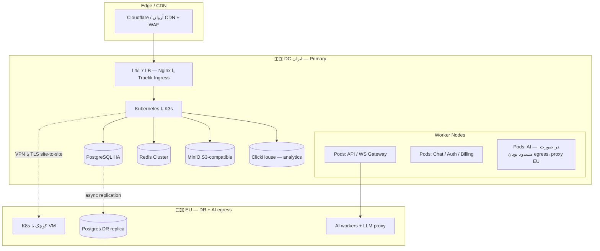

# 🖥️ سند زیرساخت، سرورها و کانفیگ (Infrastructure)

> **Chat-Box** — معماری میزبان، شبکه، خوشه، و قرارداد کانفیگ  
> **ورژن:** 1.0 · مه 2026  
> **مالک سند (نقش):** DevOps (+ Engineering برای هم‌راستایی با اپ‌ها)

این سند **جزئیات لایهٔ زیرساخت و کانفیگ عملیاتی** را جدا از [`02-ARCHITECTURE.md`](./02-ARCHITECTURE.md) نگه می‌دارد: سند ۰۲ «سیستم و سرویس‌ها» را توصیف می‌کند؛ سند **۱۴** اینجا پاسخ می‌دهد *روی چه سخت‌افزار/خوشه‌ای، با چه شبکه و چه فایل کانفیگی* اجرا می‌شود.

---

## Machine-readable index (English — for AI)

```yaml
doc_id: 14-INFRASTRUCTURE
version: 1.0.0
primary_owner_role: DEVOPS
related_docs:
  - 02-ARCHITECTURE.md
  - 03-TECH-STACK.md
  - 11-SECURITY-PRIVACY.md
  - 12-OPERATIONS-SUPPORT.md
os_baseline:
  family: linux
  distro_default: ubuntu-server-22.04-or-24.04-lts
  dev_workstation: ubuntu-desktop-or-server-22.04-or-24.04-lts
  documentation_assumes: ubuntu_only_for_dev_and_launch
  container_runtime_prod_k8s: containerd
  docker_engine: dev_and_ci_and_optional_obs_vm_only_unless_adr
environments: [development, staging, production]
primary_region: IR
dr_region: EU
```

---

## 1. اصول و مرز مسئولیت

| # | اصل | پیامد |
|---|-----|--------|
| ۱ | **Infrastructure as Code در مسیر رسمی** | هر تغییر پورت، نام DNS، یا اندازهٔ VM در Git (یا ADR) قابل ردیابی است |
| ۲ | **Secrets خارج ریپو** | فقط الگو در `.env.example`؛ مقدار واقعی در Vault/Secret Manager میزبان |
| ۳ | **تفکیک محیط** | dev/stage/prod جدا؛ دادهٔ production هرگز به dev کپی خام نشود |
| ۴ | **ایران Primary، EU برای DR و AI egress** | همسو با بخش Deployment در سند ۰۲ |
| ۵ | **حداقل امتیاز** | سرویس‌ها فقط network و DB لازم را ببینند |

---

## 2. محیط‌های اجرا (Environments)

| محیط | هدف | زیرساخت نمونه |
|--------|-----|----------------|
| **development** | توسعهٔ محلی + docker-compose | میزکار **Ubuntu** توسعه‌دهنده؛ بدون SLA |
| **staging** | تست انتشار، دادهٔ ناشناس‌سازی‌شده | یک خوشهٔ کوچک یا namespace جدا روی همان DC |
| **production** | ترافیک واقعی مشتری | Kubernetes (K3s) در DC ایران + DR در EU |

**قرارداد نام‌گذاری:**

- DNS: `api.chatbox.ir` (prod)، `api.staging.chatbox.ir` (stage)
- Kubernetes namespace: `chatbox-prod`، `chatbox-staging`
- Docker Compose پروژه: سرویس‌ها با پیشوند `cb-` (مثلاً `cb-postgres`)

---

## 3. توپولوژی لایهٔ سرور (Production — هدف)



**یادداشت MVP:** در فاز اول ممکن است به‌جای چند نود، **یک خوشهٔ کوچک K3s + Postgres تکی (با بکاپ)** کافی باشد؛ همین سند «شکل نهایی» را نگه می‌دارد تا مهاجرت تدریجی بدون بازنویسی مفهومی انجام شود.

---

## 4. نقش ماشین‌ها (Server roles)

| نقش | وظیفه | نمونه سایز اولیه (قابل تنظیم با ADR) |
|-----|--------|----------------------------------------|
| **Load Balancer / Ingress** | TLS termination، routing، rate limit لبه | ۲ vCPU، ۴GB — یا managed LB میزبان |
| **Kubernetes control plane** | etcd، scheduler | در K3s سبک؛ یا ۳ master در prod کامل |
| **Worker — stateless** | Pods اپلیکیشن Node/Python | autoscale بر اساس CPU و تعداد اتصال WS |
| **Worker — AI** | inference، queue consumer | CPU قوی؛ GPU اختیاری برای مدل محلی |
| **PostgreSQL** | OLTP + pgvector | CPU و IOPS بالا؛ دیسک NVMe |
| **Redis** | cache، pub/sub، Socket.io adapter | RAM بالا؛ persistence تنظیم‌شده |
| **MinIO** | فایل و رسانه | دیسک بزرگ؛ replication ≥ ۳ node در مقیاس |
| **ClickHouse** | analytics | CPU + فشرده‌سازی؛ جدا از مسیر تراکنش حیاتی |
| **Observability** | Prometheus، Loki، Grafana | دیسک برای retention لاگ |

### 4.1 سیستم‌عامل پیشنهادی (قاعدهٔ کلی)

| موضوع | تصمیم پیشنهادی |
|--------|----------------|
| خانوادهٔ OS | فقط **Linux**؛ **توسعه و لانچ** در این مخزن روی **Ubuntu** مستند شده است (سرور production و میزکار dev هر دو LTS اوبونتو) |
| توزیع | **Ubuntu Server 22.04 LTS** یا **24.04 LTS** برای میزبان production؛ میزکار dev همان خانواده (**Desktop یا Server** همان نسخه‌ها) |
| جایگزین مجاز | **Debian 12** برای ماشین‌های «فقط دیتابیس» در صورت سیاست میزبان |
| رابط گرافیکی | **نصب نشود** (سرور headless) |
| زمان | **NTP** فعال (`systemd-timesyncd` یا `chrony`) — برای لاگ و گواهی TLS و همزمانی WS حیاتی است |
| فایروال | **nftables** یا **ufw**؛ پیش‌فرض deny؛ فقط پورت‌های تعریف‌شده در بخش ۵ باز شوند |
| به‌روزرسانی امنیتی | `unattended-upgrades` برای patchهای امنیتی (با پنجرهٔ نگهداری مشخص) |

### 4.2 پیش‌نیازهای نصب بر اساس نقش سرور

> **تفکیک مهم:** در **production روی Kubernetes** معمولاً موتور اجرا **`containerd`** است (همراه K3s/kubeadm). نصب **Docker Engine** روی workerهای K8s **توصیه نمی‌شود** مگر با دلیل در ADR. در مقابل، روی **میزکار توسعهٔ Ubuntu** و بسیاری از **CI runner**های اوبونتو، **Docker CE** برای `docker build` و `docker compose` طبیعی است.

| نقش سرور | OS | نصب / نرم‌افزارهای ضروری (حداقل) | اختیاری یا MVP |
|-----------|-----|-----------------------------------|------------------|
| **Load Balancer / Ingress (VM)** | Ubuntu 22.04/24.04 | `nginx` یا HAProxy از مخازن رسمی؛ اگر TLS روی VM: certbot یا گواهی میزبان | `fail2ban`، `curl`، `jq` |
| **نود Kubernetes (control + worker)** | Ubuntu 22.04/24.04 | **K3s** (شامل **containerd** + `kubectl`) *یا* kubeadm + **containerd**؛ بدون Docker مگر استثنا | `open-iscsi` در صورت storage provisioner؛ `nfs-common` اگر NFS؛ `helm` روی bastion |
| **Bastion / Jump host** | Ubuntu 22.04/24.04 | `openssh-server`، `git`، `curl`، `jq`، `kubectl` (هم‌نسخه با کلاستر) | `helm`، `k9s` |
| **CI Runner (self-hosted)** | Ubuntu 22.04/24.04 | **Docker CE** + `docker compose plugin` *یا* **Podman** + compose؛ `git`؛ دسترسی به registry | اگر image در GitHub ساخته می‌شود، ممکن است فقط runner بدون Docker کافی باشد |
| **PostgreSQL (سرور اختصاصی)** | Ubuntu 22.04/24.04 | PostgreSQL از **PGDG**؛ ابزار `pg_basebackup`، `wget`/`ca-certificates` | **Patroni** + etcd برای HA؛ بدون Docker برای DB در prod مگر تصمیم صریح DevOps |
| **Redis (سرور اختصاصی)** | Ubuntu 22.04/24.04 | `redis-server` از مخزن توزیع یا بستهٔ رسمی Redis | تنظیم `sysctl` برای شبکه در بار بالا طبق مستند Redis |
| **MinIO (VM یا bare metal)** | Ubuntu 22.04/24.04 | باینری MinIO رسمی یا نصب از طریق **Helm روی K8s** (در آن صورت روی نود فقط containerd کافی است) | `mc` (MinIO Client) روی bastion |
| **ClickHouse** | Ubuntu 22.04/24.04 | پکیج/باینری رسمی یا **Helm** روی K8s | `clickhouse-client` روی bastion |
| **ماشین Observability (VM کوچک MVP)** | Ubuntu 22.04/24.04 | **Docker CE** + `docker compose` برای استک سبک (Prometheus/Grafana/Loki) *در صورت عدم استقرار داخل K8s* | مهاجرت بعدی به Pods داخل کلاستر |
| **میزکار توسعه (لپ‌تاپ یا VM)** | Ubuntu Desktop یا Server **22.04/24.04 LTS** | **Docker CE** + پلاگین compose (طبق [مستند رسمی Docker برای Ubuntu](https://docs.docker.com/engine/install/ubuntu/))، **Git**، **Node.js 20 LTS**، **Python 3.12**، **pnpm**، **OpenSSL** | VS Code / Cursor؛ `make` اختیاری؛ کلاستر محلی اختیاری با **k3d** یا **minikube** (بدون Docker Desktop) |

**نسخه‌های مرجع (هم‌تراز با [`03-TECH-STACK.md`](./03-TECH-STACK.md) — در زمان deploy با ADR به‌روز شوند):**

- Docker CE (در صورت استفاده): آخرین stable از مخزن رسمی Docker برای Ubuntu  
- K3s: آخرین stable channel رسمی Rancher  
- containerd: نسخهٔ همراه K3s/kubeadm (عدم نصب دستی جدا مگر نیاز خاص)

---

## 5. شبکه و پورت‌ها (قرارداد)

| ترافیک | پورت / پروتکل | یادداشت |
|--------|----------------|--------|
| HTTPS عمومی | 443 | فقط TLS ۱.۲+ |
| WebSocket | 443 (upgrade) | مسیر جدا روی ingress مثلاً `/socket.io/` |
| Postgres داخلی | 5432 | فقط داخل VPC / private network |
| Redis | 6379 | فایروال؛ AUTH اجباری |
| MinIO S3 API | 9000 (یا custom) | پشت reverse proxy در prod |
| مدیریت SSH | 22 | فقط bastion + کلید؛ غیرفعال با password login |

**سگمنت شبکه پیشنهادی (مفهومی):**

- `10.0.0.0/16` — VPC اصلی
- `10.0.10.0/24` — workers
- `10.0.20.0/24` — data layer (DB)
- `10.0.30.0/24` — management / bastion

---

## 6. کانفیگ اپلیکیشن (Application configuration)

### 6.1 لایه‌ها

| لایه | محتوا | مثال |
|------|--------|------|
| **Build-time** | نسخهٔ git، نام image | `GIT_SHA`, `APP_VERSION` |
| **Deploy-time** | replica، resource limits | Helm values یا ArgoCD Application |
| **Runtime** | اتصال DB، URL بیرونی | متغیرهای محیطی از Secret |
| **Feature flags** | روشن/خاموش قابلیت | سرویس جدا یا env با قرارداد مشخص |

### 6.2 قرارداد نام‌گذاری env (پیشنهاد)

- پیشوند `CB_` برای همهٔ متغیرهای اختصاصی محصول (مثلاً `CB_DATABASE_URL`)
- حداقل متغیرهای مشترک همهٔ سرویس‌های Node:
  - `CB_ENV` = `development` | `staging` | `production`
  - `CB_LOG_LEVEL`
  - `CB_OTEL_EXPORTER_OTLP_ENDPOINT` (اختیاری)

### 6.3 فایل‌های مرجع در ریپو (وقتی کد اضافه شد)

- `apps/*/.env.example` — بدون secret؛ توضیح هر کلید
- `infra/` (آینده) — Helm/Kustomize یا Terraform
- `docker-compose.yml` در root برای dev یکپارچه

---

## 7. Secrets و مدیریت کلید

| نوع | محل نگهداری پیشنهادی | چرخش (rotate) |
|------|----------------------|----------------|
| رشتهٔ اتصال Postgres | Vault / sealed secret K8s | هر ۹۰ روز یا پس از حادثه |
| کلید JWT signing | Vault، RS256 private key | نیمه‌سالانه + کلید دوگانه در چرخش |
| API keys (OpenAI، زرین‌پال، …) | Vault؛ هرگز commit نشود | طبق سیاست وندور |
| TLS certificates | cert-manager + Let's Encrypt یا cert میزبان | auto-renew ۳۰ روز قبل از انقضا |

**قاعده:** در PR فقط placeholder؛ مقدار توسط pipeline یا اپراتور روی کلاستر تزریق می‌شود ([`11-SECURITY-PRIVACY.md`](./11-SECURITY-PRIVACY.md)).

---

## 8. Kubernetes — نقشهٔ namespace و اجزای حداقلی

| Namespace | محتوا |
|-----------|--------|
| `ingress-nginx` یا `traefik` | Ingress controller |
| `cert-manager` | گواهی TLS |
| `chatbox-prod` | Deployment سرویس‌های Chat-Box |
| `observability` | Prometheus، Grafana، Loki (در صورت self-host) |

**Resource پیشنهادی هر Pod (شروع — با HPA بعداً):**

- API/Chat (Node): `requests: cpu 250m, memory 512Mi` — `limits` متناسب با load test
- AI (Python): `memory 2Gi+` بسته به مدل محلی

---

## 9. ذخیره‌سازی و پشتیبان‌گیری (زیرساخت)

| داده | محل | بکاپ |
|------|-----|------|
| Postgres | دیسک محلی یا volume مدیریت‌شده | logical daily + WAL archive؛ تست restore ماهانه ([`12-OPERATIONS-SUPPORT.md`](./12-OPERATIONS-SUPPORT.md)) |
| Redis | AOF/RDB طبق نیاز | snapshot؛ بازیابی سریع‌تر از rebuild کامل |
| MinIO | erasure coding در چند نود | replication به bucket سرد یا DC دوم |
| لاگ‌ها | Loki / فایل روی نود | retention طبق سیاست؛ جدا از DB اصلی |

---

## 10. CI/CD و تحویل به سرور

| مرحله | ابزار پیشنهادی (همسو با Tech Stack) | خروجی |
|--------|-------------------------------------|--------|
| Build & test | GitHub Actions | image تگ‌خورده با `GIT_SHA` |
| Registry | GitHub Container Registry یا registry خصوصی DC | image قابل pull از داخل ایران |
| Deploy | Argo CD (GitOps) یا اسکریپت Helm در pipeline | sync با branch `release/*` |
| Migration DB | job یک‌باره قبل یا همزمان با rollout | قرارداد در ADR |

---

## 11. IaC و نسخه‌پذیری زیرساخت

- **هدف:** تمام تغییرات firewall، سایز VM، و route در PR قابل review.
- **ابزار:** OpenTofu / Terraform برای cloud API؛ Kustomize/Helm برای manifestهای K8s.
- **شروع MVP:** حتی اگر فقط `docker-compose` و یک `README` در `infra/` باشد، باید **منبع حقیقت** مشخص باشد؛ با رشد، به IaC کامل مهاجرت شود.

---

## 12. اندازه‌گیری و مقیاس (راهنمای سفارش اولیه)

| فاز | تقریب workspace فعال | یادداشت |
|-----|----------------------|---------|
| MVP اولیه | &lt; ۱۰۰ | ۱ خوشهٔ کوچک، Postgres تکی با replica اختیاری |
| رشد | ۱۰۰ – ۱۰۰۰ | جدا کردن read replica، Redis cluster |
| مقیاس بالا | ۱۰۰۰+ | sharding topic/event، چندین pool worker |

اعداد دقیق سفارش سخت‌افزار باید با **load test** (k6) و SLA داخلی به‌روز شوند.

---

## 13. چک‌لیست قبل از اولین Production

- [ ] OS نودها **LTS**، **NTP** فعال، سیاست **patch** امنیتی مشخص
- [ ] نودهای Kubernetes فقط **containerd** (بدون Docker Engine) مگر ADR
- [ ] TLS روی تمام entrypointها فعال و HSTS
- [ ] Secretها در Vault / K8s Secret (نه git)
- [ ] Firewall: فقط پورت‌های لازم باز
- [ ] بکاپ Postgres زمان‌بندی + یک بار restore موفق
- [ ] لاگ با `correlation_id` از لبه تا سرویس
- [ ] runbook قطعی DB و failover ([`12-OPERATIONS-SUPPORT.md`](./12-OPERATIONS-SUPPORT.md))
- [ ] پایش uptime برای `api` و `widget` CDN

---

## 14. مرجع‌های مرتبط

- [`02-ARCHITECTURE.md`](./02-ARCHITECTURE.md) — C4، سرویس‌ها، Deployment Topology خلاصه
- [`03-TECH-STACK.md`](./03-TECH-STACK.md) — انتخاب K8s، Traefik، Grafana stack
- [`11-SECURITY-PRIVACY.md`](./11-SECURITY-PRIVACY.md) — mTLS، Vault، WAF
- [`12-OPERATIONS-SUPPORT.md`](./12-OPERATIONS-SUPPORT.md) — SLO، runbook، پشتیبانی
- [`15-DEVELOPMENT-GUIDE-FA.md`](./15-DEVELOPMENT-GUIDE-FA.md) — راهنمای گام‌به‌گام توسعه از نصب OS تا PR و استقرار
