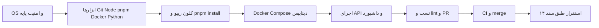

# 📘 راهنمای کامل توسعهٔ فنی Chat-Box (مسیر گام‌به‌گام)

> **نسخه:** 1.5 · مه 2026  
> **مخاطب:** توسعه‌دهندهٔ انسان یا Agent که از **صفر تا PR و تست و استقرار** جلو می‌رود.  
> **میزبان استاندارد:** **توسعه روی Windows 10/11** (Node، pnpm، Git، Cursor/VS Code)؛ **محیط شبیه پروداکشن روی Ubuntu Server 22.04 یا 24.04 LTS** روی اینترنت — انتقال با [`scripts/deploy-sync-to-server.ps1`](../scripts/deploy-sync-to-server.ps1) یا [`scripts/deploy-sync-to-server.sh`](../scripts/deploy-sync-to-server.sh) و جزئیات [`SERVER-DEV-FIRST-INSTALL-FA.md`](./SERVER-DEV-FIRST-INSTALL-FA.md).  
> **هم‌راستا با:** [`14-INFRASTRUCTURE.md`](./14-INFRASTRUCTURE.md)، [`03-TECH-STACK.md`](./03-TECH-STACK.md)، [`07-PROJECT-STRUCTURE.md`](./07-PROJECT-STRUCTURE.md)، [`roadmap_machine.md`](./roadmap_machine.md)، [`08-ROADMAP.md`](./08-ROADMAP.md).

این سند **نقشهٔ راه فنی یکپارچه** است: از ابزارهای میزکار Windows تا اجرای پروژه، تست، CI و همگام‌سازی با سرور Ubuntu. دستورهای **bash** را روی **Git Bash** (همراه Git for Windows) یا مستقیماً روی **SSH به سرور Ubuntu** اجرا کنید.

---

## نقشهٔ کلی مسیر (مرور ۳۰ ثانیه‌ای)



---

## مرحله ۰ — قبل از دست زدن به کد

| کار | توضیح |
|-----|--------|
| خواندن حکمرانی | [`00-GOVERNANCE-ROLES.md`](./00-GOVERNANCE-ROLES.md) — نقش PR و `PRIMARY_ROLE` |
| خواندن راهنمای Agent | [`09-AI-AGENT-GUIDE.md`](./09-AI-AGENT-GUIDE.md) |
| بستهٔ پرامپتها | [`roadmap_machine.md`](./roadmap_machine.md) — اگر با AI می‌سازید |
| ردیاب وضعیت مراحل | [`16-DEVELOPMENT-STATUS.md`](./16-DEVELOPMENT-STATUS.md) — بعد از هر مرحلهٔ `P…` این جدول را به‌روز کنید |
| سرور Ubuntu روی اینترنت (نصب از صفر) | [`SERVER-DEV-FIRST-INSTALL-FA.md`](./SERVER-DEV-FIRST-INSTALL-FA.md) |
| حساب GitHub | دسترسی push به ریپو؛ برای CI، Actions فعال باشد |

---

## مرحله ۱ — میزکار Windows (توسعهٔ روزمره)

### ۱.۱ پیش‌نیازها

| موضوع | اقدام |
|--------|--------|
| سیستم‌عامل | **Windows 10 یا 11** (۶۴ بیت) |
| Git | [Git for Windows](https://git-scm.com/download/win) — برای `git` و **Git Bash** |
| Node.js | **20 LTS** از [nodejs.org](https://nodejs.org/) یا [nvm-windows](https://github.com/coreybutler/nvm-windows) |
| pnpm | در **PowerShell** یا cmd: `corepack enable` سپس `corepack prepare pnpm@9 --activate` (اگر خطا داد، نسخهٔ Node را از نصب‌کنندهٔ رسمی بگیرید) |
| Docker (اختیاری) | **Docker Desktop** فقط اگر می‌خواهید Postgres/Redis را **روی همان PC** با `docker compose` بالا بیاورید؛ در غیر این صورت DB را روی **سرور Ubuntu** نگه دارید و از `.env` به آن وصل شوید. |

### ۱.۲ مسیر پیشنهادی پروژه روی Windows

پوشهٔ ریپو را زیر مسیر کوتاه نگه دارید (مثلاً `C:\dev\chat-box`) تا مسیرها و ابزارها کمتر به حد طولانی Windows بخورند.

### ۱.۳ سرور Ubuntu (شبیه پروداکشن)

نصب Node، Docker، مسیر دپلوی و اجرای API روی سرور: **[`SERVER-DEV-FIRST-INSTALL-FA.md`](./SERVER-DEV-FIRST-INSTALL-FA.md)**.  
همگام‌سازی فایل‌ها از PC به سرور: **`scripts/deploy-sync-to-server.ps1`** (PowerShell) یا **`scripts/deploy-sync-to-server.sh`** (Git Bash با `rsync`).

### ۱.۴ امنیت و زمان روی سرور Ubuntu

- کاربر غیر root با `sudo`؛ SSH با **کلید** نه رمز.  
- زمان و NTP روی سرور طبق سند زیرساخت.

---

## مرحله ۲ — امنیت پایه روی Ubuntu Server (در صورت استفاده)

طبق [`14-INFRASTRUCTURE.md`](./14-INFRASTRUCTURE.md) بخش ۴.۱:

```bash
sudo apt update && sudo apt upgrade -y
sudo apt install -y chrony ufw fail2ban
sudo systemctl enable --now chrony
sudo ufw default deny incoming
sudo ufw default allow outgoing
sudo ufw allow 22/tcp
sudo ufw enable
```

> پورتهای بعدی (۸۰، ۴۴۳، …) وقتی سرویس نصب شد اضافه شوند.

---

## مرحله ۳ — Git و SSH

```bash
sudo apt update
sudo apt install -y git openssh-client
```

### کلید SSH برای GitHub

```bash
ssh-keygen -t ed25519 -C "your_email@example.com"
# محتوای ~/.ssh/id_ed25519.pub را در GitHub → Settings → SSH keys اضافه کنید
ssh -T git@github.com
```

---

## مرحله ۴ — Node.js 20 LTS و pnpm

### پیشنهاد: نصب از طریق مدیر نسخه (fnm یا nvm)

**fnm (پیشنهاد — نصب از [مستند رسمی fnm](https://github.com/Schniz/fnm) برای Linux):**

```bash
fnm install 20
fnm use 20
node -v   # باید v20.x شود
```

**pnpm 9:**

```bash
corepack enable
corepack prepare pnpm@9 --activate
pnpm -v
```

---

## مرحله ۵ — Docker

نصب **Docker CE** و پلاگین **Compose** طبق [راهنمای رسمی Docker برای Ubuntu](https://docs.docker.com/engine/install/ubuntu/). سپس کاربر توسعه را به گروه `docker` اضافه کنید و یک بار session را تازه کنید:

```bash
sudo usermod -aG docker "$USER"
# سپس logout/login یا newgrp docker
docker --version
docker compose version
```

### تست

```bash
docker run --rm hello-world
```

> روی **نودهای Kubernetes production** معمولاً Docker Engine نصب نمی‌شود؛ فقط `containerd`. این مرحله برای **dev** است ([`14-INFRASTRUCTURE.md`](./14-INFRASTRUCTURE.md)).

---

## مرحله ۶ — Python 3.12 (برای سرویس AI وقتی به ریپو اضافه شد)

### pyenv (اختیاری ولی تمیز)

```bash
# پس از نصب pyenv طبق مستندش:
pyenv install 3.12.7
pyenv local 3.12.7
python -V
```

### یا نصب سیستمی Ubuntu

```bash
sudo apt install -y python3.12 python3.12-venv python3-pip
```

---

## مرحله ۷ — IDE و افزونه‌ها

| ابزار | توضیح |
|--------|--------|
| **Cursor** یا **VS Code** | باز کردن پوشهٔ ریشهٔ `chat-box` |
| افزونه‌ها | ESLint/Biome (هرکدام پروژه انتخاب کرد)، Docker، Markdown، GitLens |
| تنظیمات | `format on save` مطابق `biome.json` وقتی در ریپو اضافه شد |

---

## مرحله ۸ — کلون ریپو و نصب وابستگی monorepo

```bash
git clone git@github.com:<ORG>/chat-box.git
cd chat-box
pnpm install
```

اگر هنوز `pnpm-workspace` وجود ندارد، ابتدا بستهٔ **`P0.2`** در [`roadmap_machine.md`](./roadmap_machine.md) را با AI یا دستی انجام دهید.

```bash
pnpm exec turbo run build --filter=...
# یا اسکریپت‌های تعریف‌شده در root package.json
```

---

## مرحله ۹ — فایل محیط `.env`

1. از **`.env.example`** در ریشه یا `apps/api` کپی بگیرید:  
   `cp .env.example .env` (مسیر دقیق وقتی در ریپو وجود دارد).  
2. مقادیر **بدون commit** را پر کنید: `DATABASE_URL`، `REDIS_URL`، کلیدهای تست.  
3. هرگز `.env` را به git اضافه نکنید.

---

## مرحله ۱۰ — بالا آوردن Postgres و Redis (محلی)

در ریشهٔ پروژه (بعد از اضافه شدن `docker-compose.yml`):

```bash
docker compose up -d
docker compose ps
```

اتصال سریع Postgres (در صورت نگاشت پورت پیش‌فرض):

```bash
# مثال اگر postgres روی localhost:5432 باشد
psql "$DATABASE_URL" -c "SELECT 1"
```

---

## مرحله ۱۱ — اجرای API در حالت توسعه

```bash
pnpm --filter api dev
# یا معادل تعریف‌شده در package.json
```

تست سلامت:

```bash
curl -s http://127.0.0.1:3001/health
```

> شمارهٔ پورت را با `.env` و README ریپو هماهنگ کنید.

---

## مرحله ۱۲ — اجرای داشبورد و ویجت (وقتی apps اضافه شدند)

```bash
pnpm --filter dashboard dev
pnpm --filter widget build
```

برای ویجت، فایل دمو اگر وجود دارد (مثلاً `apps/widget/demo.html`) را در مرورگر باز کنید و به API/WS محلی وصل کنید.

---

## مرحله ۱۳ — تست واحد و یکپارچگی

```bash
pnpm test
# یا
pnpm exec turbo run test
```

- تست‌های مرتبط با تغییر خود را **حداقل** اجرا کنید.  
- برای DB: در صورت وجود، از container تست یا `docker compose` پروفایل جدا استفاده کنید.

---

## مرحله ۱۴ — تست E2E (Playwright وقتی اضافه شد)

```bash
pnpm exec playwright install
pnpm --filter e2e test
```

قبل از اولین اجرا: متغیر `BASE_URL` یا معادل در `.env` تست را مطابق README تنظیم کنید.

---

## مرحله ۱۵ — Lint و فرمت و typecheck قبل از PR

```bash
pnpm lint
pnpm typecheck
```

طبق [`03-TECH-STACK.md`](./03-TECH-STACK.md) معمولاً **Biome** جایگزین ESLint+Prettier است.

---

## مرحله ۱۶ — ساخت branch و PR

```bash
git checkout -b feat/<ticket>-short-description
git add -A
git commit -m "feat(api): concise message"
git push -u origin feat/<ticket>-short-description
```

در GitHub **Pull Request** بسازید و در بدنه حتماً بنویسید ([`09-AI-AGENT-GUIDE.md`](./09-AI-AGENT-GUIDE.md)):

```text
PRIMARY_ROLE: ENGINEERING
RELATED_DOCS: 05-API-SPEC.md
MVP_LABEL: MVP
TEST: pnpm test --filter api
ROLLBACK: migration down / revert commit
```

---

## مرحله ۱۷ — CI سبز و Code Review

1. تا **سبز شدن** workflow در GitHub صبر کنید.  
2. حداقل یک **review** انسانی (یا Agent review طبق `roadmap_machine`).  
3. تغییرات **اسناد کاننیکال** (`docs/*.md`) را اگر لازم است در همان PR به‌روز کنید.  
4. برای MDهایی که HTML دارند:  
   `python docs/scripts/build_doc_html.py <STEM>`

---

## مرحله ۱۸ — merge و همگام‌سازی محلی

```bash
git checkout main
git pull
pnpm install
```

---

## مرحله ۱۹ — استقرار (staging / production)

این مرحله **فقط خلاصه** است؛ جزئیات در [`14-INFRASTRUCTURE.md`](./14-INFRASTRUCTURE.md) و [`12-OPERATIONS-SUPPORT.md`](./12-OPERATIONS-SUPPORT.md):

| گام | کار |
|-----|-----|
| ۱ | ساخت image با تگ `GIT_SHA` در CI |
| ۲ | push به registry قابل دسترس از سرور |
| ۳ | deploy با Helm/Argo یا اسکریپت میزبان |
| ۴ | اجرای migration قبل یا همزمان با rollout |
| ۵ | smoke test روی `/health` و یک مسیر بحرانی |
| ۶ | پایش لاگ و dashboard (Grafana/Loki) |

---

## مرحله ۲۰ — بعد از استقرار

- بررسی **خطاها** در Sentry (اگر فعال است).  
- تأیید **backup** اولیه زمان‌بندی شده.  
- ثبت نسخه در CHANGELOG یا release notes.

---

## عیب‌یابی رایج

| علامت | احتمال | اقدام |
|--------|---------|--------|
| `ECONNREFUSED` به Postgres | سرویس compose بالا نیست | `docker compose up -d` و بررسی پورت |
| `pnpm: command not found` | Node/corepack | `corepack enable` و نصب pnpm |
| WebSocket قطع | پروکسی یا فایروال | مسیر `/socket.io` و TLS پشت LB |
| migration خطا | نسخهٔ Postgres | با نسخهٔ `docker-compose` هماهنگ کنید |
| خطای permission Docker | کاربر خارج از گروه docker | `sudo usermod -aG docker $USER` و logout |

---

## چک‌لیست یک‌صفحه‌ای (چاپ ذهنی قبل از PR)

- [ ] `pnpm lint` و `pnpm typecheck` سبز  
- [ ] تست مرتبط سبز  
- [ ] `.env` commit نشده  
- [ ] `PRIMARY_ROLE` در PR  
- [ ] اسناد `05`/`04`/`06` در صورت تغییر قرارداد به‌روز شده‌اند  

---

## مرجع‌های سریع اسناد

| موضوع | سند |
|--------|-----|
| Tech stack | [`03-TECH-STACK.md`](./03-TECH-STACK.md) |
| ساختار ریپو | [`07-PROJECT-STRUCTURE.md`](./07-PROJECT-STRUCTURE.md) |
| API | [`05-API-SPEC.md`](./05-API-SPEC.md) |
| DB | [`04-DATABASE-SCHEMA.md`](./04-DATABASE-SCHEMA.md) |
| AI | [`06-AI-ARCHITECTURE.md`](./06-AI-ARCHITECTURE.md) |
| زیرساخت سرور | [`14-INFRASTRUCTURE.md`](./14-INFRASTRUCTURE.md) |
| بستهٔ پرامپت AI | [`roadmap_machine.md`](./roadmap_machine.md) |
| ردیاب وضعیت مراحل | [`16-DEVELOPMENT-STATUS.md`](./16-DEVELOPMENT-STATUS.md) |
| نصب سرور Ubuntu از صفر | [`SERVER-DEV-FIRST-INSTALL-FA.md`](./SERVER-DEV-FIRST-INSTALL-FA.md) |

**پایان سند.** با تغییر فرآیند تیم، این فایل را نسخه‌دار کنید و در PR به‌روز کنید.
